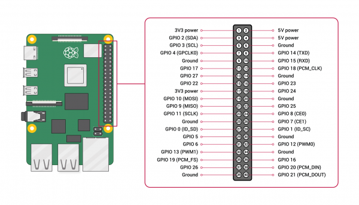

# Another BASIC? Really?

There is no shortage of BASIC dialects. The language is sixty years old, and over those decades it has appeared in hundreds of forms - from corporate/classroom mainframes, to every 8‑bit home computer, in pocket calculators, and today in half a dozen actively maintained modern interpreters, online or offline. So the first fair question to ask about ***BerryBasiC*** is: why one more?

The honest answer is that BerryBasiC is not really trying to be a *better BASIC*. It is trying to bring back a particular *experience* that modern computing has almost entirely lost - and BASIC happens to be the most natural language for it.

Think about what made the home‑computer BASICs of the 1980s so formative for a generation of programmers. It was not the syntax, which was often clumsy. It was that when you switched the machine on, **you and the computer were the only two things in the room.** There was no operating system between you. You typed `PRINT "HELLO"` and it happened. You wrote a number to a memory address and a pixel changed colour. You could, with a little courage, understand the *entire* machine - from the character you typed to the electrons on the screen - because there was nothing hidden.

That directness has quietly disappeared. A modern computer is a complex machine of layered abstractions: your program runs inside a runtime, inside a sandbox, inside a process, inside an operating system of tens of millions of lines, on top of firmware you will never see. Every layer is there for a good reason, and together they are a marvel. But no one person can hold the whole thing in their head anymore, and a beginner writing their first line of code is standing at the bottom of a very tall building with no way to see the top.

BerryBasiC exists to hand you a whole machine again - a small, comprehensible, *complete* machine that you own from the first instruction to the last pixel - running on cheap, modern, genuinely powerful hardware, the ***Raspberry PI 4***. It is not nostalgia for old syntax. It is nostalgia for **transparency**.

## What makes BerryBasiC different

The thing that sets BerryBasiC apart from every other BASIC you can install today is where it runs: **on bare metal.** It is not an application on Linux or Windows. It is the single program running on the Raspberry Pi. When the Pi powers on, there is no operating system to load - BerryBasiC takes the role of the operating system, just like a classic **BBC Micro** or a **Commodore** would do it. It boots to a `>` prompt in a second, and everything the machine can do, it does through the interpreter.

That single fact colours everything else. But BerryBasiC is not a museum piece, and four things keep it from being one:

- **It is a modern, structured BASIC.** The spaghetti of `GOTO` and line numbers is still there if you want it, but you rarely need it. There are named procedures and functions with local variables and recursion, block `IF`/`ELSE`/`ENDIF`, `FOR`/`REPEAT`/`WHILE`/`CASE` loops, structured error handling with `TRY`/`CATCH`, and reusable code libraries you pull in with `IMPORT`. You can write clean, readable programs in it.
- **It owns the hardware directly.** The graphics screen, sound, the mouse and keyboard, files on the SD card, and - the reason many people come to it - the 40 pins of the GPIO header are all reachable with a single plain keyword. No driver, no device file, no permission dance. `PIN 17, 1` lights an LED. That is the whole story.
- **It has an escape hatch to full native speed.** Interpreting BASIC is friendly but slow. When a job needs to run at the speed of the silicon - an image filter, a simulation, a tight numeric loop - you write a *seed*: a small piece of compiled native code that BerryBasiC loads from the card and calls like a function, running in a safe sandbox. You stay in approachable BASIC for everything else and drop to the metal only where it counts. Very few languages give beginners both ends of that spectrum in one place.
- **It is legible all the way down.** The interpreter is a single C program you can read, understand, and extend. There is no hidden magic - which is the whole point.

## What you can do with it

BerryBasiC is a machine for *making things you can see, hear, and touch.* A few of the things it is built for:

**Learn to program from the ground up.** Everything is immediate - type a statement at the prompt and it runs - and the concepts build naturally from a first `PRINT` to loops, procedures, and graphics. Because there is no framework to learn first, the ideas stay in the foreground.

**Blink an LED, read a sensor, control the world.** This is physical computing, and it is where a bare‑metal BASIC on a Pi truly comes alive. Buttons, sensors and other pins are read and driven just as simply, so a working thermostat, a burglar alarm, or a reaction‑timer game is a short evening's project rather than a stack of libraries.

**Make games and graphics.** There is a full graphics screen with lines, shapes, flood fill, 24‑bit truecolour, and sprites you can capture from the screen or load from PNG, JPEG and BMP files. There is four‑channel sound. There is a mouse, keyboard, and an event system that runs your code when a timer fires or a pin changes.

**Build a little appliance.** Because BerryBasiC owns the whole machine, a program *is* the machine. Point a Pi at a program and it can boot straight into a kiosk, a game console, a data logger, or a dedicated instrument - no desktop, no login, just your creation.

**Tinker at the metal.** You can reserve raw blocks of memory and read and write them byte by byte, pass a buffer to a native seed to crunch at full speed, and generally see how a computer actually works underneath the friendly words. For the systems‑curious, it is a sandbox for exactly the kind of low‑level poking that a modern OS normally forbids.

## Who it is for

BerryBasiC is written for people who want to *understand* the computer, not just command it from a safe distance.

That includes **complete beginners and students**, who get a machine where cause and effect are always visible and nothing has to be taken on faith. It includes **teachers**, for whom a device that boots to a prompt and blinks an LED in five lines is a wonderful way to make both programming and electronics tangible. It includes **hobbyists, makers, and retrocomputing enthusiasts** who remember (or wish they had known) the directness of the old machines and want it back on hardware that can actually keep up. And it includes **tinkerers and systems‑minded programmers** who would like to touch bare metal - to own the interrupts, the timers, the pins, and every last byte of RAM - without having to write an entire operating system first.

It is worth being equally clear about who it is *not* for, at least today. If you are building a production web service, shipping a cross‑platform app, or leaning on a vast ecosystem of third‑party packages, BerryBasiC is the wrong tool and makes no apology for it. It is deliberately small, deliberately hardware‑bound, and deliberately focused on the machine in front of you.

## The bargain of direct hardware access

The defining choice in BerryBasiC - running on bare metal, with nothing between your program and the silicon - is a genuine trade‑off, and it is worth understanding both sides before you begin, because the same decision that gives the system its magic also gives it its sharp edges.

| Direct hardware access gives you…                            | …at the cost of                                              |
| ------------------------------------------------------------ | ------------------------------------------------------------ |
| **Immediacy.** `PIN 17, 1` drives a pin with nothing in between - cause and effect are visible, which is priceless for learning. | **No safety net.** There is no operating system to catch a mistake; a wrong pin or a bad memory write can hang the machine or, electrically, damage what you have wired up. |
| **Predictable timing.** No scheduler, no background tasks stealing cycles - your program has the processor to itself, so timing is yours to control. | **No multitasking or isolation.** One program runs at a time; if it crashes, everything stops and you reboot. There is no process boundary to contain a fault. |
| **Simplicity.** No drivers, device files, or permissions - one keyword reaches the hardware. | **You build it or do without.** If the interpreter doesn't already expose something (a network stack, an exotic device), you write a seed for it or go without; there is no library to install. |
| **You own the whole machine.** All the RAM, all four cores, every cycle, nothing hidden. | **You own the responsibility too.** Correctness and *electrical safety* are on you - put the resistor on that LED - and recovering from a hard lock‑up means switching the power off and on. |
| **Legibility.** The whole system is small enough to understand top to bottom. | **Portability.** It is tied to specific hardware; the pin registers and boot process are the Raspberry Pi's, not a write‑once‑run‑anywhere abstraction. |

Read that table and the cons might look like a list of reasons not to bother. They are not. **The constraints are the point.** The reason a bad `POKE` can hang the machine is the same reason a good one lights a pixel with no ceremony: there is nothing in the way. The reason there is no safety net is the same reason there is nothing hidden. You are accepting a little risk and a little responsibility in exchange for a computer you can actually see all the way through - and for learning, for making, and for the sheer pleasure of understanding the machine, that is an excellent bargain.

The rest of this manual shows you how to spend it.

# BerryBasiC Quick Intro

BerryBasiC is a small, BBC-flavoured BASIC interpreter that runs on a Raspberry Pi 4 (and in a QEMU emulator on your desktop). It is a *tokenless* interpreter: you type a program as numbered lines, and it runs the source directly. If you have ever used BBC BASIC, Acorn BASIC, or one of the 8‑bit home‑computer BASICs, most of this will feel familiar; if you are new to BASIC entirely, the rest of this manual is written to be read start to finish.

At a glance, BerryBasiC supports:

- Line‑numbered programs **and** direct‑mode commands typed at the prompt
- Floating‑point, integer (`%`) and string (`$`) variables, plus arrays of up to three dimensions
- Collections: dictionaries (text‑keyed), growable lists, and sorted binary trees
- Named procedures (`PROC`) and functions (`FN`), local variables, and recursion
- Structured control flow: `IF`/`THEN`/`ELSE`/`ENDIF`, `FOR`, `REPEAT`, `WHILE`, `CASE`
- `DATA`/`READ`/`RESTORE` for built‑in constant tables
- Reusable code libraries via `IMPORT`
- Console I/O, a USB keyboard and mouse, and a centisecond clock
- Files on the SD card, opened as channels for byte‑ or record‑level I/O, plus a full set of directory commands
- Graphics: BBC‑style `PLOT`/`MOVE`/`DRAW`, a high‑level shape library, truecolour (24‑bit) drawing, sprites (with scaling, rotation and tinting), double buffering, render‑to‑sprite, tilemaps, anti‑aliased TrueType text, and PNG/JPEG/BMP image loading and saving
- `VDU` commands for fine screen control, user‑defined characters, viewports and palettes
- Hardware on the 40‑pin header: digital GPIO (with edge events) and an I2C master for add‑on boards
- Reserved memory blocks read and written with the `?` / `!` / `$` indirection operators
- **Native "seeds"** - compiled AArch64 machine code, loaded from the card and called from BASIC, for the parts of a job that need full native speed

Throughout this manual, code you type or that appears in a program is shown in a monospaced block:

```basic
10 PRINT "HELLO, WORLD"
20 GOTO 10
```

Text the machine prints back is shown as plain output:

```text
HELLO, WORLD
HELLO, WORLD
...
```

## Getting Started

When BerryBasiC starts it prints a banner and then a `>` prompt:


The `>` is where you type. Everything you enter is one of two things:

- **A numbered line** - it is *stored* as part of your program and not run yet.
- **Anything else** - it is a *direct‑mode command*, run immediately.

### Direct mode

Type a statement with no line number and press Return, and it runs at once:

```basic
>PRINT 2 + 2
4
>PRINT "Hi "; "there"
Hi there
```

Direct mode is handy for quick sums, for inspecting variables, and for the commands that manage your program (`LIST`, `RUN`, `SAVE`, `NEW`, and so on). Most statements work in direct mode exactly as they do in a program; the few that only make sense inside a running program (such as `FOR`/`NEXT` spanning several lines, or `RETURN`) will say so.

### Writing a program

Give a line a number and it is remembered instead of run:

```basic
>10 PRINT "HELLO"
>20 PRINT "AGAIN"
>RUN
HELLO
AGAIN
>
```

Lines are always kept sorted by number, however you type them, so you can enter them in any order and insert new ones later by choosing a number in between (this is why programs are traditionally numbered 10, 20, 30 - it leaves room to squeeze `15` in). `LIST` shows the program in order; `RUN` executes it from the lowest line number.

### Editing and deleting lines

- **Replace a line:** type it again with the same number. The new text replaces the old.
- **Delete a line:** type its number alone and press Return.
- **Edit a line in place:** `EDIT 20` recalls line 20 into the input so you can change it (see *Program Control Commands*).

```basic
>20 PRINT "CHANGED"      : REM replaces line 20
>20                      : REM deletes line 20
```

### A first program

```basic
10 REM My first BerryBasiC program
20 INPUT "What is your name"; NAME$
30 PRINT "Hello, "; NAME$; "!"
40 FOR I = 1 TO 3
50   PRINT "Beep "; I
60 NEXT I
70 END
```

Type `RUN` to run it, `LIST` to see it, and `SAVE "HELLO"` to keep it on the card (it becomes `HELLO.BAS`). `LOAD "HELLO"` brings it back.

# Program Structure

A program is a list of numbered lines. Each line holds one or more statements.

```basic
10 PRINT "HELLO"
20 GOTO 10
```

## Several statements on one line

A colon `:` separates statements, so a single line can do several things:

```basic
10 A = 10 : B = 20 : PRINT A + B
```

Execution runs left to right along the line, then moves to the next line.

## Comments

`REM` (remark) turns the rest of the line into a comment - the interpreter ignores everything after it:

```basic
10 REM This whole line is a note
20 A = 5 : REM ...and so is this, after the colon
```

Because `REM` swallows the rest of the line, put it last.

## Line length and program size

A single line may be up to 128 characters. A program may hold up to 8192 lines. (See *Appendix B: Limits* for the full list.)

# Data Types

There are exactly two kinds of values in BerryBasiC: **numbers** and **strings**. Every variable holds one or the other, and its *name* decides which.

A variable name starts with a letter and may contain letters and digits (and the underscore `_`). A trailing `%` or `$` is part of the name - and it counts towards the length. Names are up to 8 characters including that suffix, so keep to seven letters plus a suffix to be safe. Names are not case‑sensitive: `Count`, `COUNT` and `count` are the same variable (they are all folded to upper case internally).

| Name ends in… | Holds | Example |
|---------------|-------|---------|
| *(nothing)*   | a floating‑point number | `RADIUS`, `X`, `TOTAL` |
| `%`           | a whole number (integer) | `COUNT%`, `I%` |
| `$`           | text (a string) | `NAME$`, `LINE$` |

A variable springs into existence the first time you assign to it; there is no separate "declare" step (arrays are the exception - see *Arrays*). A numeric variable that has never been assigned reads as `0`; an unassigned string reads as `""`.

## Floating point (the default)

A plain name, with no suffix, is a floating‑point variable. Numbers are held as **double‑precision** IEEE‑754 floating point, so both fractions and large magnitudes are kept accurately (about 15–16 significant decimal digits internally).

```basic
A = 12.5
B = 3.14159
RADIUS = 2.5
AREA = PI * RADIUS * RADIUS
```

## Integer variables (`%`)

A name ending in `%` holds a whole number. Whenever you assign to it, the value is **truncated towards zero** - the fractional part is simply dropped (this is truncation, not rounding):

```basic
I% = 12.9
PRINT I%
```

```text
12
```

Negative values truncate towards zero as well, so `I% = -12.9` gives `-12`. Integer variables make good loop counters and array indices, they run a touch faster, and they document intent ("this is a count"). Internally they behave as 32‑bit integers, which matters for the bitwise operators.

## String variables (`$`)

A name ending in `$` holds text. A string may be from 0 up to **255** characters long. The empty string is written `""`.

```basic
NAME$ = "BERRY"
EMPTY$ = ""
```

Join strings with `+`, and take them apart with the string functions (`LEFT$`, `RIGHT$`, `MID$`, `LEN`, `INSTR`, …), all described under *String Functions*.

```basic
FULL$ = "BERRY" + " " + "PI"      : REM "BERRY PI"
```

## Type mismatches

Numbers and strings never mix silently. Trying to add a number to a string, assign one to the other, or compare across types raises `Type mismatch: numbers and text can't be mixed`. Convert explicitly with `STR$` (number → text) and `VAL` (text → number) when you need to cross the divide.

# How Numbers Are Displayed

When `PRINT` (or `STR$`) turns a number into text, BerryBasiC uses these rules:

- A **whole number** prints with no decimal point: `PRINT 42` → `42`.
- Otherwise up to **9 significant digits** are shown, with trailing zeros trimmed: `PRINT 1/8` → `0.125`, `PRINT 2/3` → `0.666666667`.
- **Very large or very small** magnitudes switch to scientific "E" notation with a signed, two‑digit exponent: `PRINT 1e12` → `1E+12`, `PRINT 1.5e-9` → `1.5E-09`. The switch happens for exponents of about `+9` and above, or `−5` and below.
- Special values print as `INF` (magnitude beyond the double range) and `NAN` (not‑a‑number, e.g. `0/0` situations).

The value stored is always the full double precision; only its *printed* form is rounded to nine figures. When you need a particular layout - fixed decimals, right‑aligned columns, currency, zero‑padding, or hexadecimal/binary - reach for the **Formatted Output** functions below rather than the default form.

## Formatted Output

The default number-to-text rules above are fine for casual output, but reports, tables and hardware work often need exact control. BerryBasiC provides three tools: `HEX$`/`BIN$` for base conversion, `FORMAT$` for templated numbers, and `PRINT USING` for laying out a column.

### `HEX$` and `BIN$` - other bases

`HEX$(n)` returns `n` as uppercase hexadecimal text (no `&` prefix); `BIN$(n)` returns it in binary. Both take the value as a **32-bit integer**, read as unsigned two's-complement exactly like the BBC, so negatives wrap:

```basic
PRINT HEX$(255)        : REM FF
PRINT BIN$(10)         : REM 1010
PRINT HEX$(-1)         : REM FFFFFFFF
PRINT "0x" + HEX$(4080): REM 0xFF0   (composes like any string)
```

An optional second argument is a **minimum width**; shorter values are zero-padded, longer ones are shown in full:

```basic
PRINT HEX$(255, 4)     : REM 00FF
PRINT BIN$(10, 8)      : REM 00001010
```

These pair naturally with `&`-hex and `%`-binary literals (see *Numeric Literals*) for register work: `I2CWRITE &27, %00001000`.

### `FORMAT$(template$, value)` - templated numbers

`FORMAT$` renders one number as text according to a template string, and returns it. Within the template:

| Char | Meaning |
|------|---------|
| `#` | a digit position; **blank** if the number doesn't need it (leading blanks) |
| `0` | a digit position; **zero** if the number doesn't need it (leading zeros) |
| `.` | the decimal point; the number of `#`/`0` after it sets the decimal places (the value is **rounded** to fit) |
| `,` | placed in the integer part, inserts **thousands** separators |
| leading `+` | always show a sign (`+` or `-`) |
| leading `-` | show a sign only when negative (this is the default) |

Any other character - currency symbols, spaces, units - is **literal** and copied straight through. The integer part is never truncated: if the number needs more digits than the template provides, the field simply grows.

```basic
PRINT FORMAT$("####.##", 3.14159)   : REM "   3.14"   (right-aligned, 2 places)
PRINT FORMAT$("000.00", 3.1)        : REM "003.10"    (zero-padded)
PRINT FORMAT$("#,###,###", 1234567) : REM "1,234,567"
PRINT FORMAT$("+#0.0", 5)           : REM "+5.0"      (forced sign)
PRINT FORMAT$("$#,##0.00", 1999.5)  : REM "$1,999.50" (literal $ copied through)
```

Because the width is fixed, `FORMAT$` is the easy way to print a tidy column:

```basic
10 FOR I = 1 TO 3
20   PRINT FORMAT$("######.00", I * 12.5)
30 NEXT
```

produces three right-aligned, two-decimal numbers stacked in a column.

If the template contains no digit position at all, the error is `Bad format template`.

### `PRINT USING template$; item; item; …`

`PRINT USING` is a shorthand for printing several numbers with the **same** template. Each numeric item is formatted as `FORMAT$` would; string items, `TAB`/`SPC` and the usual `;`/`,` spacing behave exactly as in an ordinary `PRINT`:

```basic
PRINT USING "######.00"; total, tax, net   : REM three aligned money columns
PRINT USING "#,##0"; score                 : REM 1,234,567
```

It applies the one template per item - ideal for a column of similarly-formatted values. (A multi-field template, GW-BASIC style, is not supported; use `FORMAT$` and build the line yourself if you need mixed fields.)

# Constants

BerryBasiC defines a few constants of convenience, for easier access to common numerical values.

## PI

`PI` is the ratio of a circle's circumference to its diameter, 3.14159265358979…

```basic
PRINT PI
```

Use it with the trigonometric functions, which work in **radians** - a full turn is `2 * PI`:

```basic
PRINT SIN(PI / 2)        : REM 1
```

## TRUE

`TRUE` is the value a comparison gives when it holds. It is `-1` - every bit set - which is what makes the logical operators double as bitwise ones (see *Operators*).

```basic
PRINT TRUE               : REM -1
IF TRUE THEN PRINT "YES"
```

## FALSE

`FALSE` is the value a comparison gives when it does **not** hold. It is `0`.

```basic
PRINT FALSE              : REM 0
```

`IF` treats **any non‑zero number** as true, so `TRUE` and `FALSE` are conveniences rather than the only truth values - `IF 5 THEN …` runs, and so does `IF A$ <> "" THEN …`.

---

# Numeric Literals

One of the most basic operations a program can do is to print meaningful numbers on a screen. In BerryBasic you can write numbers in four ways.

## Decimal

Ordinary decimal, with or without a fractional part:

```basic
A = 123
B = 12.34
C = .5                   : REM a leading dot is fine (= 0.5)
```

## Scientific (E) notation

A number may carry an exponent, written with `E` (or lower‑case `e`) followed by an optional sign and the power of ten. This is the compact way to write very large or very small values:

```basic
A = 2E3                  : REM 2000
B = 1.5E-4               : REM 0.00015
C = 6.022E23             : REM Avogadro's number
```

The `E` form is only recognised when digits actually follow it, so a variable such as `E` or `EXIT` is never mistaken for an exponent.

## Hexadecimal

An ampersand `&` introduces a base‑16 (hexadecimal) constant, BBC‑style. The digits `A`–`F` may be upper or lower case:

```basic
A = &FF
PRINT A
```

```text
255
```

Hex is convenient for bit masks, colours and memory addresses:

```basic
MASK = &00FF00           : REM the green byte of an RGB value
```

## Binary

A percent sign `%` followed by `0`s and `1`s is a base‑2 (binary) constant - the natural companion to `&`‑hex when you care about individual bits:

```basic
A = %1010                : REM 10
MASK = %1100 OR %0011    : REM 15  (bitwise OR of two nibbles)
PINSET %00001000         : REM bit 3 set
```

(The `%` is only read as a binary literal when a `0` or `1` follows it; attached to a variable name it remains the integer‑variable suffix, as in `COUNT%`.) Turn a number back into hexadecimal or binary text with `HEX$` and `BIN$` (see *Formatted Output*).

# Assignment

Assignment copies the value on the right into the variable on the left.

The keyword `LET` is optional. These two lines mean exactly the same thing:

```basic
LET A = 10
A = 10
```

The right‑hand side may be any expression of the matching type:

```basic
TOTAL = PRICE * QTY
GREETING$ = "Hello, " + NAME$
```

Assigning to an integer (`%`) variable truncates towards zero, as described under *Data Types*. Assigning across types (a number to a `$` variable, or text to a numeric one) is an error.

Array elements and reserved‑memory locations are assigned the same way; see *Arrays* and *Memory and Indirection*.

# Operators

Like every self-respecting programming language, BerryBasiC also supports mathematical operations.

## Arithmetic

| Operator | Meaning |
|----------|---------|
| `+`      | Add (or, between two strings, join them) |
| `-`      | Subtract; as a prefix, negate |
| `*`      | Multiply |
| `/`      | Divide (always a floating‑point result) |
| `^`      | Raise to a power |

```basic
PRINT 2 ^ 8              : REM 256
PRINT 10 / 4             : REM 2.5   (division never rounds to an integer)
```

## Integer division - `DIV`

`DIV` divides and throws away the remainder, giving a whole‑number result (both operands are first truncated to integers):

```basic
PRINT 7 DIV 2            : REM 3
```

## Remainder - `MOD`

`MOD` gives the remainder that `DIV` discards:

```basic
PRINT 7 MOD 2            : REM 1
```

Dividing by zero - with `/`, `DIV` or `MOD` - raises `Division by zero`.

## Relational

The comparison operators compare two numbers, or two strings, and return `TRUE` (`-1`) or `FALSE` (`0`):

| Operator | True when… |
|----------|------------|
| `=`  | the operands are equal |
| `<>` | they differ |
| `<`  | the left is less than the right |
| `>`  | the left is greater than the right |
| `<=` | the left is less than or equal |
| `>=` | the left is greater than or equal |

```basic
IF A <> 0 THEN PRINT "NONZERO"
IF NAME$ = "BERRY" THEN PRINT "Hi Berry"
```

Strings compare **character by character** by code value (so uppercase letters sort before lowercase, digits before letters), and a shorter string sorts before a longer one that begins with it (`"CAT" < "CATS"`).

## Logical / bitwise - `AND` `OR` `EOR` `NOT`

`AND`, `OR`, `EOR` (exclusive‑or) and the prefix `NOT` work bit by bit on 32‑bit integers.

| Operator | Result |
|----------|--------|
| `AND` | bits set in **both** operands |
| `OR`  | bits set in **either** operand |
| `EOR` | bits set in **exactly one** operand |
| `NOT` | inverts every bit (so `NOT 0` is `-1`, and `NOT TRUE` is `0`) |

Because `TRUE` is `-1` (all bits set) and `FALSE` is `0`, the very same operators serve as logical connectives inside conditions:

```basic
PRINT 6 AND 3                       : REM 2   (bit masking)
IF A > 0 AND B > 0 THEN PRINT "BOTH POSITIVE"
IF DONE OR TIMED_OUT THEN GOTO 500
```

## Shifts and rotates

Bit shifts and rotates are written as functions and operate on 32‑bit integers:

| Function    | Meaning |
|-------------|---------|
| `SHL(x, n)` | shift `x` left by `n` bits (zeros in from the right) |
| `SHR(x, n)` | logical shift right by `n` bits (zeros in; treats `x` as unsigned) |
| `ASR(x, n)` | arithmetic shift right by `n` bits (copies the sign bit; keeps negatives negative) |
| `ROL(x, n)` | rotate left by `n` bits, within 32 bits |
| `ROR(x, n)` | rotate right by `n` bits, within 32 bits |

```basic
PRINT SHL(1, 4)          : REM 16
PRINT SHR(256, 4)        : REM 16
PRINT ASR(-8, 1)         : REM -4  (sign preserved)
PRINT ROL(1, 1)          : REM 2
```

A shift count of 32 or more gives `0` for `SHL`/`SHR`; a negative count is an error. Shifts and masks together pack and unpack fields - for example an RGB colour:

```basic
COL = SHL(R, 16) OR SHL(G, 8) OR B
R   = SHR(COL, 16) AND 255
```

## String concatenation

`+` between two strings joins them:

```basic
FULL$ = FIRST$ + " " + LAST$
```

## Indirection - `?` `!` `$`

`?`, `!` and `$` read or write memory directly - a byte, a 32‑bit word, and a CR‑terminated string respectively. They are covered fully under *Memory and Indirection*:

```basic
?addr                    : REM the byte at addr
addr!4                   : REM the 32-bit word at addr+4
$addr                    : REM the string at addr, up to a carriage return
```

## Precedence

Operators bind in the order below, from **loosest** (evaluated last) to **tightest** (evaluated first). Use parentheses whenever you want a different order - or simply for clarity.

| Level | Operators | Notes |
|-------|-----------|-------|
| 1 (loosest) | `OR`, `EOR` | bitwise/logical |
| 2 | `AND` | bitwise/logical |
| 3 | `=` `<>` `<` `>` `<=` `>=` | comparisons yield `-1`/`0` |
| 4 | `+` `-` | add/subtract, and string join |
| 5 | `*` `/` `DIV` `MOD` | |
| 6 | unary `-`, unary `+`, `NOT` | prefix operators |
| 7 | `^` | power; binds *tighter* than unary minus |
| 8 (tightest) | `?` `!` (binary form) | indirection postfix |

Two consequences worth remembering:

- Because `^` binds tighter than unary minus, `-2 ^ 2` is `-(2 ^ 2) = -4`, not `4`.
- Because binary `?` / `!` bind tightest, `BUF%?I + 1` means `(BUF%?I) + 1`. For an arithmetic *address* with the unary form, parenthesise it - `?(BUF% + 1)` - or use the binary form, `BUF%?1`.

Power is left‑associative here: `2 ^ 3 ^ 2` is `(2 ^ 3) ^ 2 = 64`.

# PRINT Statement

`PRINT` writes a list of items to the screen and (usually) ends with a newline. The **separator** between items decides the spacing.

## Basic output

```basic
PRINT "HELLO"
```

## Expressions

An item may be any numeric or string expression; numbers are converted to text using the rules under *How Numbers Are Displayed*:

```basic
PRINT A + B
PRINT "Area = "; PI * R * R
```

## Multiple items

A **semicolon** `;` joins items with no space at all:

```basic
PRINT "X="; X; " Y="; Y
```

A **comma** `,` moves to the next *print field*. Fields are 8 columns wide, so columns line up into a table:

```basic
PRINT A, B, C
```

## Suppressing the newline

A separator (`;` or `,`) at the very **end** of the line suppresses the closing newline, so the next `PRINT` carries on where this one stopped:

```basic
PRINT "HELLO";
PRINT "WORLD"
```

```text
HELLOWORLD
```

## Forcing a newline - `'`

A single quote (apostrophe) `'` inside the list forces a newline, a compact way to print several lines from one statement:

```basic
PRINT "Line 1" ' "Line 2" ' "Line 3"
```

## `TAB(n)`

`TAB(n)` moves the print position **forward** to column `n` (columns count from 0) by emitting spaces. If the cursor is already at or past column `n`, it does nothing - `TAB` never moves backwards and never starts a new line.

```basic
PRINT "Name"; TAB(12); "Score"
```

## `SPC(n)`

`SPC(n)` outputs exactly `n` spaces, wherever the cursor happens to be:

```basic
PRINT "A"; SPC(5); "B"
```

# INPUT Statement

`INPUT` reads a line typed by the user and stores it into one or more variables. It shows a `?` prompt while waiting.

## Numeric input

Reads a number. Any non‑numeric text at the field is read as `0`.

```basic
INPUT A
```

## String input

Reads text into a string variable. Spaces are kept, so the field may contain them:

```basic
INPUT NAME$
```

## A prompt string

Put a string, then `;` (or `,`), before the variable to use it as the prompt. A `? ` is always printed after your prompt text:

```basic
INPUT "NAME"; NAME$
```

The interpreter shows:

```text
NAME? 
```

## Several variables at once

You may fill several variables from one statement. On the typed line, separate the values with **commas**:

```basic
INPUT A, B, C
```

All the variables are filled from a single typed line. If the user supplies fewer values than requested, the remaining variables are left at `0` (or `""` for strings). Because commas separate fields, a single string field taken this way cannot itself contain a comma.

To read structured data back from a file with the same feel, see `INPUT#` under *File Handling*.

# Branching

While having an archaic feel to it, `GOTO` can be a very useful construct from time to time.

## GOTO

`GOTO` jumps to another line and continues from there:

```basic
GOTO 100
```

`GOTO` (and `GOSUB`) may also jump to a **label** instead of a line number, which reads better and survives `RENUMBER`.

## Labels

A label is a name introduced with a leading dot, sitting on its own at the start of a line. Jump to it by name (the dot is optional in the jump):

```basic
10 GOTO main
20 .greet
30   PRINT "Hello"
40 RETURN
50 .main
60 GOSUB greet
70 END
```

Labels are never touched by `RENUMBER`, so `GOTO done` keeps working no matter how the program is renumbered.

## IF … THEN (single line)

The simplest form runs the rest of the line only when the condition holds:

```basic
IF A = 10 THEN PRINT "TEN"
```

The condition is true for any non‑zero number (and for a non‑empty string). Several things may follow `THEN`, separated by colons:

```basic
IF OK THEN PRINT "Saving" : GOSUB save : PRINT "Done"
```

`THEN` may be **omitted** in the single‑line form - `IF A = 10 PRINT "TEN"` works too - but writing `THEN` is clearer.

If what follows `THEN` is a bare **line number**, that is an implicit `GOTO` (a classic BASIC shorthand):

```basic
IF SCORE > HIGH THEN 900       : REM same as: IF SCORE > HIGH THEN GOTO 900
```

## IF … THEN … ELSE

`ELSE` supplies the alternative:

```basic
IF A = 10 THEN PRINT "TEN" ELSE PRINT "OTHER"
IF N < 0 THEN 800 ELSE 810     : REM either branch may be a line-number jump
```

## Block IF (multi‑line)

When `THEN` is the **last** thing on the line, `IF` starts a multi‑line block that runs until `ENDIF`. An optional `ELSE` (on its own) selects the alternative block. Blocks may be nested.

```basic
10 IF SCORE >= 50 THEN
20   PRINT "Pass"
30   PRINT "Well done"
40 ELSE
50   PRINT "Try again"
60 ENDIF
```

The single‑line form keeps its classic behaviour; the block form is chosen only when nothing follows `THEN` on the line. (The block form needs a stored program - it cannot be used from the direct‑mode prompt.)

## ON … GOTO

`ON` selects a target from a list by a 1‑based index:

```basic
ON N GOTO 100, 200, 300
```

| `N` | Jumps to |
|-----|----------|
| 1   | 100 |
| 2   | 200 |
| 3   | 300 |

A value outside the range (0, negative, or larger than the list) simply falls through to the next statement.

## ON … GOSUB

The same idea, but each target is called as a subroutine and control returns after the `ON` when the subroutine's `RETURN` runs:

```basic
ON CHOICE GOSUB 1000, 2000, 3000
```

---

# Subroutines

`GOSUB` and `RETURN` are the classic line‑numbered subroutine mechanism. For new code the named `PROC`/`FN` forms (see *Procedures* and *Functions*) are usually clearer, but `GOSUB` remains for compatibility and quick jobs.

## GOSUB

Jumps to a line (or label) and remembers where it came from:

```basic
10 GOSUB 100
20 PRINT "Back again"
30 END
100 PRINT "In the subroutine"
110 RETURN
```

Up to 32 `GOSUB`s may be active (nested) at once.

## RETURN

Returns to the statement immediately after the `GOSUB` that called this subroutine. A `RETURN` with no matching `GOSUB` raises `RETURN without a matching GOSUB`.

---
# FOR Loops

A `FOR` loop counts a variable from a start value to a limit, running its body once for each value. The limit is tested at the **top** of each pass, so a loop whose start is already past the limit runs zero times.

## Basic loop

The counter goes up by 1 each pass, from 1 to 10 inclusive:

```basic
FOR I = 1 TO 10
  PRINT I
NEXT
```

`NEXT` may name its variable (`NEXT I`) for clarity - helpful when loops are nested. Up to 16 `FOR` loops may be nested.

## STEP

`STEP` sets the amount added each pass:

```basic
FOR I = 0 TO 20 STEP 2
  PRINT I
NEXT
```

`STEP` may be fractional (`STEP 0.1`). Beware that fractional steps can accumulate tiny floating‑point errors over many passes.

## Negative STEP

A negative `STEP` counts down; the loop continues while the counter is at or **above** the limit:

```basic
FOR I = 10 TO 1 STEP -1
  PRINT I
NEXT
```

## Nesting

Nested loops close in reverse order (innermost first). Naming the variable on each `NEXT` makes the pairing explicit:

```basic
FOR Y = 1 TO 3
  FOR X = 1 TO 3
    PRINT X * Y;
  NEXT X
  PRINT
NEXT Y
```

---

# REPEAT Loops

## REPEAT … UNTIL

The body runs first, then the condition is tested, so a `REPEAT` loop always runs **at least once**. It repeats *until* the condition becomes true:

```basic
A = 0
REPEAT
  A = A + 1
  PRINT A
UNTIL A = 10
```

Use `WHILE` instead when the body should be skippable from the very start. Up to 16 `REPEAT` loops may be nested.

---

# WHILE Loops

## WHILE … ENDWHILE

`WHILE` tests its condition **before** each pass, so the body may run zero times. It repeats while the condition stays true:

```basic
10 N = 1
20 WHILE N <= 5
30   PRINT N
40   N = N + 1
50 ENDWHILE
```

Compared with `REPEAT … UNTIL` (tested at the bottom, always runs once), `WHILE` is the right choice when the body should be skipped entirely if the condition is false to start with. Up to 16 `WHILE` loops may be nested.

---

# Loop Control - EXIT and CONTINUE

`EXIT` and `CONTINUE` change the flow of the enclosing `FOR`, `REPEAT` or `WHILE` loop without resorting to a `GOTO`.

## EXIT

`EXIT` leaves a loop immediately, continuing after its terminator (`NEXT`, `UNTIL` or `ENDWHILE`).

```basic
10 FOR i = 1 TO 1000
20   IF a(i) = target THEN found = i : EXIT FOR
30 NEXT
40 PRINT "found at "; found
```

On its own, `EXIT` leaves the **innermost** loop, whatever its kind. You can name the kind to be explicit - `EXIT FOR`, `EXIT REPEAT`, `EXIT WHILE` - which leaves the innermost loop of that kind, breaking out of any loops nested inside it too.

## CONTINUE

`CONTINUE` skips the rest of the current pass and goes straight to the loop's next test: `FOR` advances the counter, `REPEAT` and `WHILE` re‑check their condition.

```basic
10 FOR n = 1 TO 10
20   IF n MOD 2 = 0 THEN CONTINUE FOR : REM skip the even numbers
30   PRINT n
40 NEXT
```

Like `EXIT`, a bare `CONTINUE` acts on the innermost loop, and `CONTINUE FOR` / `CONTINUE REPEAT` / `CONTINUE WHILE` name the kind.

---

# Error Handling - TRY and CATCH

Instead of letting an error stop the program, wrap the risky part in a `TRY … CATCH … ENDTRY` block. If any statement between `TRY` and `CATCH` raises an error, control jumps to the code after `CATCH`; if nothing goes wrong, the handler is skipped.

```basic
10 TRY
20   ch = OPENIN "DATA.TXT"
30   PRINT "opened channel "; ch
40 CATCH
50   PRINT "Could not open the file: "; ERR$
60 ENDTRY
70 PRINT "carrying on"
```

Errors raised inside a `PROC` or `FN` called from the `TRY` block are caught too - the whole call is unwound cleanly back to the handler, so loops and locals are restored and the program can keep running.

## ERR and ERR$

Inside (and after) a `CATCH`, two read‑only values describe what happened:

* `ERR$` - the error message as text.
* `ERR` - a numeric code: the number you passed to `RAISE`, or `0` for a built‑in error.

## RAISE

`RAISE` throws your own error, which the nearest enclosing `CATCH` will handle.

```basic
RAISE "something went wrong"        : REM message only (ERR = 0)
RAISE 404                           : REM a numeric code
RAISE 404, "not found"              : REM code and message
```

A `TRY` with no matching `CATCH` still needs an `ENDTRY`; blocks may be nested, and an inner handler catches an error without disturbing an outer one.

---

# CASE Selection

## CASE … OF … WHEN

`CASE` picks one branch by matching an expression against the values listed by each `WHEN`. A single `WHEN` may list several comma‑separated values. `OTHERWISE` catches anything that matched no `WHEN`, and `ENDCASE` closes the statement. The selector may be numeric or a string.

```basic
10 CASE DAY OF
20   WHEN 1, 7: PRINT "Weekend"
30   WHEN 6:    PRINT "Almost there"
40   OTHERWISE  PRINT "Weekday"
50 ENDCASE
```

Only the first matching `WHEN` (or `OTHERWISE`) runs; control then continues after `ENDCASE`. Each clause's statements may follow on the same line after a colon, or on the lines below until the next `WHEN` / `OTHERWISE` / `ENDCASE`. `CASE` needs a stored program (it cannot be used from the direct prompt), and up to 16 `CASE` statements may be nested.

A string example:

```basic
10 CASE CMD$ OF
20   WHEN "N", "NORTH": PROCgo_north
30   WHEN "S", "SOUTH": PROCgo_south
40   OTHERWISE PRINT "I don't understand."
50 ENDCASE
```

---

# Arrays

`DIM` reserves an array. Indices start at **0**, so `DIM A(N)` gives `N+1` elements, `A(0)` through `A(N)` (BBC BASIC semantics). Up to **3** dimensions are supported, and up to 16 arrays may exist at once. Every element starts at `0` (or `""` for a string array).

## One dimension

```basic
DIM A(10)                : REM elements A(0) .. A(10)
A(0) = 100
A(1) = A(0) + 1
PRINT A(1)
```

## Two dimensions

Bounds are given per dimension; `DIM GRID(9, 9)` is a 10×10 grid:

```basic
DIM GRID(9, 9)
GRID(2, 3) = 7
```

## Three dimensions

```basic
DIM CUBE(3, 3, 3)
CUBE(1, 1, 1) = 42
```

## String arrays

A `$` array holds a string in every element:

```basic
DIM NAME$(20)
NAME$(0) = "BERRY"
NAME$(1) = "PI"
```

An index outside the declared bounds raises `Array index out of range`, and re‑`DIM`ing an existing array raises `That array is already defined`. Arrays are cleared (along with all other variables) whenever a program is `RUN`, and by `NEW` and `LOAD`.

---

# Collections

Arrays are fixed in size and indexed by number. For jobs that need something more flexible, BerryBasiC has three **collections**: a **dictionary** (values looked up by a text key), a **list** (an ordered sequence you can grow, push onto and pop from), and a **binary tree** (values keyed by number, kept permanently in sorted order).

## How collections work

You create a collection with `NEWDICT`, `NEWLIST` or `NEWTREE`, which returns a small number - a **handle** - that you keep in a variable and pass to the other collection words:

```basic
10 scores = NEWDICT              : REM scores now refers to a new, empty dictionary
20 DICTSET scores, "ada", 95
30 PRINT DICTGET(scores, "ada")  : REM 95
```

A few rules apply to all three:

- Every collection can hold **numbers or text**, mixed freely. You read a value back with the plain word for a number (`DICTGET`, `LISTGET`, `POP`, `TREEGET`) or the **`$` form** for text (`DICTGET$`, `LISTGET$`, `POP$`, `TREEGET$`), exactly as variables split into `A` and `A$`. Asking for the wrong kind raises `Type mismatch`.
- `SIZE(h)` gives the number of items in **any** collection.
- Collections live in their own memory and are **cleared when a program is `RUN`** (and by `NEW`), just like variables. Up to 64 may exist at once.
- Passing a value that isn't a collection handle raises `Not a collection`; using the wrong word for the kind (say `PUSH` on a dictionary) raises `Not a list` / `Not a dictionary` / `Not a tree`.

## Dictionary - keyed by text

A dictionary maps a **text key** to a value. Keys are unique: setting an existing key replaces its value.

| Word | Meaning |
|------|---------|
| `d = NEWDICT` | Create a new, empty dictionary. |
| `DICTSET d, key$, value` | Store `value` under `key$` (adds it, or replaces the existing one). |
| `DICTGET(d, key$)` / `DICTGET$(d, key$)` | Read the value as a number / as text. A **missing key reads as `0` or `""`** (use `DICTHAS` to tell the difference). |
| `DICTHAS(d, key$)` | `TRUE` if the key is present, else `FALSE`. |
| `DICTDEL d, key$` | Remove the key (does nothing if it isn't there). |
| `DICTKEY$(d, i)` | The `i`‑th key (0‑based, in the order keys were first added) - for walking every entry. |

```basic
10 phone = NEWDICT
20 DICTSET phone, "alice", "555-1234"
30 DICTSET phone, "bob",   "555-9876"
40 FOR i = 0 TO SIZE(phone) - 1
50   k$ = DICTKEY$(phone, i)
60   PRINT k$; " -> "; DICTGET$(phone, k$)
70 NEXT
```

## List - a growable, ordered sequence

A list holds items in order, indexed from **0**, and grows as you add to it. `PUSH` and `POP` at the end make it a natural **stack**.

| Word | Meaning |
|------|---------|
| `l = NEWLIST` | Create a new, empty list. |
| `PUSH l, value` | Append `value` to the end. |
| `POP(l)` / `POP$(l)` | Remove and return the **last** item as a number / as text. `POP` on an empty list raises `List is empty`. |
| `LISTGET(l, i)` / `LISTGET$(l, i)` | Read item `i` (0‑based) as a number / as text. |
| `LISTSET l, i, value` | Replace item `i`. |
| `LISTINS l, i, value` | Insert `value` **before** index `i` (use `i = SIZE(l)` to append). |
| `LISTDEL l, i` | Remove item `i`, closing the gap. |

An index outside `0 … SIZE(l)-1` raises `Index out of range`.

```basic
10 stack = NEWLIST
20 PUSH stack, 10 : PUSH stack, 20 : PUSH stack, 30
30 PRINT "top is "; POP(stack)          : REM 30, and the list shrinks to 2
40 PRINT "now holds "; SIZE(stack); " items"
```

## Binary tree - numbers, always sorted

A tree stores values keyed by a **number**, and - unlike a dictionary - keeps its keys in **sorted order** at all times. That makes it ideal when you need the smallest/largest key, or to visit everything in order, cheaply.

| Word | Meaning |
|------|---------|
| `t = NEWTREE` | Create a new, empty tree. |
| `TREESET t, key, value` | Store `value` under the number `key` (adds or replaces). |
| `TREEGET(t, key)` / `TREEGET$(t, key)` | Read the value as a number / as text (`0`/`""` if the key is absent). |
| `TREEHAS(t, key)` | `TRUE` if the key is present. |
| `TREEDEL t, key` | Remove the key, keeping the rest sorted. |
| `TREEMIN(t)` / `TREEMAX(t)` | The smallest / largest key (raises `Tree is empty` if there are none). |
| `TREEKEY(t, i)` | The `i`‑th key in ascending order (0‑based) - walk `i = 0 … SIZE(t)-1` to read every key sorted. |

```basic
10 t = NEWTREE
20 TREESET t, 50, "M" : TREESET t, 20, "T" : TREESET t, 80, "E"
30 TREESET t, 10, "A" : TREESET t, 30, "L"
40 PRINT "smallest key: "; TREEMIN(t)
50 FOR i = 0 TO SIZE(t) - 1
60   k = TREEKEY(t, i)
70   PRINT k; " = "; TREEGET$(t, k)         : REM printed in ascending key order
80 NEXT
```

Because a collection error is an ordinary error, you can wrap risky operations in `TRY … CATCH` (see *Error Handling*).

---

# Memory and Indirection

Beyond variables and arrays, a program can reserve a block of raw bytes and read or write it directly with the indirection operators `?`, `!` and `$`. This is how you build a buffer to hand to a native seed for fast processing, or to pack binary data.

## Reserving memory

`DIM name size` - a name **without** parentheses - reserves `size + 1` bytes and puts the address of the first byte in the variable:

```basic
DIM BUF% 255             : REM 256 bytes; BUF% now holds their address
```

Use a numeric variable (typically a `%` integer, since it holds an address). The block lives until the next `RUN`/`NEW`. Reserve several at once with commas: `DIM A% 100, B% 1000`.

## The indirection operators

| Form        | Meaning |
|-------------|---------|
| `?addr`     | the byte at `addr` (0–255) |
| `addr?n`    | the byte at `addr + n` |
| `!addr`     | the 32‑bit word at `addr` (little‑endian, signed) |
| `addr!n`    | the word at `addr + n` |
| `$addr`     | the string at `addr`, up to a carriage‑return (`&0D`) terminator |

They work on **both** sides of `=` - reading (peek) and writing (poke):

```basic
?BUF% = 65               : REM poke a byte
BUF%?1 = 66              : REM poke the next byte
PRINT ?BUF%, BUF%?1      : REM 65  66
!BUF% = &12345678        : REM poke a 32-bit word (little-endian)
PRINT BUF%?0             : REM 120  (&78, the low byte)
$BUF% = "BERRY"          : REM write text plus a CR terminator
PRINT $BUF%              : REM BERRY
```

Binary `?`/`!` bind tighter than arithmetic, so `BUF%?I + 1` is `(BUF%?I) + 1`. For an arithmetic *address* with the unary form, parenthesise it - `?(BUF% + 1)` - or just use the binary form, `BUF%?1`.

## PEEK and POKE

If you are coming from Microsoft‑style BASICs, `PEEK` and `POKE` are provided as familiar aliases for byte access. They read and write exactly the same memory as `?`, so you can mix the two freely.

| Alias           | Same as       |
| --------------- | ------------- |
| `POKE addr, b`  | `?addr = b`   |
| `PEEK(addr)`    | `?addr`       |

```basic
10 DIM BUF 16
20 POKE BUF, 65           : REM store a byte (kept modulo 256)
30 POKE BUF + 1, 66
40 PRINT PEEK(BUF); PEEK(BUF + 1)     : REM 65 66
50 PRINT CHR$(PEEK(BUF))              : REM A
```

There is no separate `PEEK`/`POKE` for words or strings - use `!` for a 32‑bit word and `$` for a string, as above.

> On this bare‑metal machine an address is a **real** memory address, not a slot in a 64 KB sandbox. `POKE`ing a made‑up address can crash the system, so poke inside memory you reserved with `DIM name size` (as here) unless you are deliberately writing to a known hardware register. Classic pokes like `POKE 53280, 0` have no meaning here.

## Passing a buffer to a seed

Because the address is a real pointer, a seed can read or write the same memory. Build the buffer in BASIC and pass its address (and length):

```basic
10 DIM B% 9
20 FOR I = 0 TO 9 : B%?I = I * I : NEXT
30 SEED H%, "BUFSUM.SED"
40 PRINT CALL(H%, B%, 10)        : REM the seed sums the 10 bytes -> 285
```

with the seed dereferencing the address it is given:

```c
SEED_EXPORT(bufsum) {
    const unsigned char *p = (const unsigned char *)(uintptr_t)(long)argv[0].num;
    int len = (int)argv[1].num, sum = 0;
    for (int i = 0; i < len; i++) sum += p[i];
    return sum;
}
```

This is the fast path for bulk data: BASIC owns the buffer, the seed crunches it natively, and both see the same bytes.

---

# DATA Processing

`DATA` holds constants inside the program; `READ` copies them into variables one after another; `RESTORE` chooses where the next `READ` starts. All the `DATA` lines in the program form one continuous list, read in line‑number order.

## DATA

Lists values to be read later. `DATA` lines may appear anywhere in the program (they are skipped during normal execution):

```basic
10 DATA 10, 20, 30
```

## READ

Takes the next item(s) from the `DATA` list, in order, and stores them. Reading past the end of the list raises `READ ran out of DATA`:

```basic
READ A, B, C
```

## String DATA

A `DATA` item may be a quoted string; read it into a string variable. The type read must match the variable's type:

```basic
10 DATA "RED", "GREEN", "BLUE"
20 READ A$, B$, C$
```

## RESTORE

Restart reading from the very first `DATA` item:

```basic
RESTORE
```

Or restart from the first item on (or after) a given line, which lets you keep several independent tables in one program:

```basic
RESTORE 100
```

A worked example - reading a table until it is exhausted:

```basic
10 FOR I = 1 TO 3
20   READ NM$, SCORE
30   PRINT NM$; " scored "; SCORE
40 NEXT
50 DATA "Ann", 40, "Ben", 55, "Cid", 33
```

---
# Procedures

A **procedure** is a named block of statements you can call by name. Procedures make a program readable and let you reuse a piece of logic without copying it.

## Definition

Define a procedure with `DEF PROC`*name* and end it with `ENDPROC`. Two spellings are accepted and are equivalent - the glued classic form and the spaced form:

```basic
10 DEF PROChello
20   PRINT "HELLO"
30 ENDPROC
```

```basic
10 DEF PROC hello
20   PRINT "HELLO"
30 END PROC
```

## Calling

Run a procedure by writing its name with the `PROC` prefix attached:

```basic
40 PROChello
```

Control returns to the statement after the call when `ENDPROC` (or `END PROC`) is reached.

## Parameters

Parameters are listed in parentheses and passed **by value**, so changing a parameter inside the procedure never affects the caller's variable:

```basic
10 DEF PROCadd(A, B)
20   PRINT A + B
30 ENDPROC
40 PROCadd(10, 20)       : REM prints 30
```

A procedure may call itself; recursion works as long as nesting stays within limits (up to 32 nested `PROC`/`FN` calls).

## LOCAL variables

`LOCAL` makes a variable private to the procedure: its previous value is saved on entry and restored on `ENDPROC`. This keeps a procedure - including a recursive one - from disturbing variables of the same name elsewhere:

```basic
10 DEF PROCtest
20   LOCAL A
30   A = 100
40   PRINT A
50 ENDPROC
```

List several after `LOCAL`, separated by commas: `LOCAL I, J, TMP$`.

---

# Functions

A function is like a procedure but **returns a value**, so it can be used inside an expression.

## Definition

Define a function with `DEF FN`*name*`(`parameters`)`. There are two equivalent styles for returning the result:

The recommended, readable style - assign to a variable whose name matches the function, then close with `END FN`:

```basic
10 DEF FN square(x)
20   square = x * x
30 END FN
```

The classic BBC style - glue the name to `FN` and return with a line beginning `=`, which both supplies the result and ends the function:

```basic
10 DEF FNsquare(x)
20 = x * x
```

Both are entirely equivalent, and a function defined either way can be **called** either way. Parameters are passed by value, and a function may use `LOCAL` and may call itself:

```basic
10 DEF FN fact(n)
20   IF n <= 1 THEN fact = 1 ELSE fact = n * fact(n - 1)
30 END FN
```

## Using a function

Call it by name, as part of an expression - its result can go anywhere a value is allowed:

```basic
40 a = square(5)
50 PRINT a
```

```text
25
```

The name alone is enough - `square(5)` - because the interpreter recognises it as a defined function. The classic `FN` forms, `FNsquare(5)` (glued) and `FN square(5)` (spaced), work too and mean exactly the same thing.

---

# Modules (IMPORT)

A **module** is an ordinary BASIC file that holds a collection of functions and procedures. `IMPORT` pulls a module into your program so you can call everything it defines - a simple way to build a library of reusable code and share it between programs.

## Writing a module

A module is just a normal `.BAS` file containing `DEF FN` / `DEF PROC` definitions. For example, save this as `MATHLIB`:

```basic
10 DEF FN gcd(a, b)
20   IF b = 0 THEN gcd = a ELSE gcd = gcd(b, a MOD b)
30 END FN
40 DEF FN lcm(a, b)
50   lcm = a * b / gcd(a, b)
60 END FN
```

## Using a module

Put `IMPORT "name"` in your program (usually near the top). Every function and procedure the module defines then becomes callable, exactly as if you had typed it into your own program:

```basic
10 IMPORT "MATHLIB"
20 PRINT "gcd = "; gcd(48, 36)
30 PRINT "lcm = "; lcm(4, 6)
```

As with `LOAD`, a name with no extension gets `.BAS` added, so `IMPORT "MATHLIB"` reads `MATHLIB.BAS`.

## Line numbers don't clash

A module keeps its **own line‑number space**. The module above uses lines 10–60, and the program that imports it *also* uses 10–30 - that is completely fine. `GOTO`, `GOSUB`, `RESTORE` and labels inside a module only ever see that module's own lines, and the same in your main program. You never have to renumber a module to avoid overlapping with the code that imports it.

## Notes

- Modules may import other modules; imports are followed automatically. A module is loaded only once even if several modules ask for it. Up to 16 modules may be imported.
- Imported lines are not part of your program: `LIST` and `SAVE` show only the code you typed, and imports are resolved fresh each time you `RUN`.
- Keep to functions and procedures in a module. `IMPORT` itself does nothing at run time - it is handled once, before the program starts.

---

# Dynamic Evaluation - EVAL and EXEC

BerryBasiC parses your program from its source text every time it runs a line, so it can just as easily parse text you build **while the program is running**. Two words expose that:

- `EVAL(string)` - a **function** that parses `string` as an expression and returns its value.
- `EXEC string` - a **statement** that runs `string` as a line of BASIC.

Both work in the **current context**: they see the same variables, arrays and open loops as the code around them. This is what makes a calculator, a config‑file reader, a lookup table of formulas, or an in‑program command line only a few lines of code.

## EVAL

```basic
result = EVAL(expression$)
```

`EVAL` evaluates the string exactly as if you had typed the expression in place, using all the usual operators, functions, variables and precedence. It returns whatever the expression is - a **number** or a **string**:

```basic
10 X = 5
20 PRINT EVAL("2*X + 1")          : REM 11 - reads the current X
30 PRINT EVAL("SQR(9) + 3*2")     : REM 9  - functions and precedence
40 A$ = "foo" : B$ = "bar"
50 PRINT EVAL("A$ + B$")          : REM foobar - a string result
```

An `EVAL` result drops straight into a larger expression, and `EVAL` may even appear inside the string it evaluates:

```basic
PRINT EVAL("X*2") + 100
```

A simple calculator is now one line - read a line of text and print its value:

```basic
10 REPEAT
20   INPUT "> " expr$
30   PRINT EVAL(expr$)
40 UNTIL expr$ = ""
```

If the string is not a valid expression, `EVAL` raises `Syntax error in EVAL string` (or whatever specific error the expression itself triggers, such as a type mismatch). Wrap it in `TRY … CATCH` to keep a command loop alive:

```basic
10 TRY
20   PRINT EVAL(expr$)
30 CATCH
40   PRINT "Sorry: "; ERR$
50 ENDTRY
```

## EXEC

```basic
EXEC statement$
```

`EXEC` runs the string as if it were a line you typed - one statement or several separated by colons. It is the companion to `EVAL`: `EVAL` computes a value, `EXEC` performs an action. Because it runs in the current context, an assignment inside `EXEC` sets a real variable:

```basic
10 EXEC "Y = 7 * 6"
20 PRINT Y                         : REM 42
```

The power is that you can **build the statement as text**, which gives you dynamic dispatch and table‑driven code. Here the variable *name* is computed at run time:

```basic
10 FOR I = 1 TO 3
20   EXEC "V" + STR$(I) + " = I*I"    : REM sets V1, V2, V3
30 NEXT
40 PRINT V1; V2; V3                   : REM 1 4 9
```

A line of statements works too, and control flow such as `GOTO`, `GOSUB` or `END` inside the string takes effect in your program:

```basic
10 EXEC "A=1 : B=2 : PRINT A+B"       : REM 3
20 EXEC "GOTO 100"                    : REM jumps the program to line 100
```

Execution returns to whatever followed the `EXEC`, so you can keep going on the same line:

```basic
10 EXEC "PRINT 1+1" : PRINT "done"
```

> **Keep an `EXEC` string self‑contained.** It is fine to branch out of an `EXEC`, but do not *open* a block you don't also close inside the same string - an `EXEC "FOR I=1 TO 3"` with the matching `NEXT` elsewhere leaves the loop pointing at text that no longer exists. Open and close a loop, `IF` block, or `TRY` within the one string, or not at all.

## Where this is useful

| Pattern | How |
|---------|-----|
| Calculator / formula entry | `PRINT EVAL(line$)` |
| Config file of `KEY = value` lines | `EXEC line$` for each line read from the file |
| A table of formulas by name | store expression strings, `EVAL` the chosen one |
| Dynamic dispatch (name computed at run time) | `EXEC "PROC" + cmd$ + "(x)"` |
| An in‑program command line | read a line, `EXEC` it inside `TRY … CATCH` |

---

# String Functions

Character positions in strings are **1‑based**: the first character is position 1. Length and count arguments are clamped to the string, so asking for more characters than exist simply returns as many as there are (never an error).

## LEN

Number of characters in a string.

```basic
PRINT LEN("HELLO")       : REM 5
```

## ASC

Character code of the first character. `ASC("")` raises `Invalid argument`.

```basic
PRINT ASC("A")           : REM 65
```

## CHR$

The one‑character string for a character code (0–255).

```basic
PRINT CHR$(65)           : REM A
```

## STR$

Converts a number to its printed text form (the same form `PRINT` would use).

```basic
PRINT STR$(123)          : REM 123
```

## VAL

Reads a number from the front of a string, stopping at the first character that can't be part of one; leading non‑numeric text gives `0`. It accepts a leading sign, a decimal point, and `E`‑notation (it does **not** read `&`‑hex).

```basic
PRINT VAL("123")         : REM 123
PRINT VAL("3.5 apples")  : REM 3.5
PRINT VAL("-2.5E3")      : REM -2500
```

## LEFT$

The leftmost `n` characters. If `n` exceeds the length the whole string is returned; if `n` is 0 or less, the empty string.

```basic
PRINT LEFT$("HELLO", 3)  : REM HEL
```

## RIGHT$

The rightmost `n` characters, clamped the same way.

```basic
PRINT RIGHT$("HELLO", 2) : REM LO
```

## MID$

`MID$(s, start)` returns from position `start` to the end; `MID$(s, start, n)` returns at most `n` characters from that position. `start` is 1‑based.

```basic
PRINT MID$("HELLO", 2, 3): REM ELL
PRINT MID$("HELLO", 3)   : REM LLO
```

## STRING$

A string made of `n` copies of another string.

```basic
PRINT STRING$(10, "*")   : REM **********
```

## INSTR

Position of the first occurrence of the second string within the first, or `0` if it is not found. An optional third argument gives the 1‑based position to start searching from.

```basic
PRINT INSTR("HELLO", "LL")       : REM 3
PRINT INSTR("ABABAB", "AB", 2)   : REM 3
```

## UPPER$ / LOWER$

Return the string converted to upper or lower case.

```basic
PRINT UPPER$("Hello")      : REM HELLO
PRINT LOWER$("Hello")      : REM hello
```

## TRIM$

Return the string with leading and trailing whitespace removed.

```basic
PRINT "["; TRIM$("  hi  "); "]"    : REM [hi]
```

## REPLACE$

`REPLACE$(text$, find$, with$)` returns `text$` with **every** occurrence of `find$` replaced by `with$`. If `with$` is empty the matches are deleted.

```basic
PRINT REPLACE$("a,b,c", ",", " / ")     : REM a / b / c
PRINT REPLACE$("mississippi", "s", "")  : REM miiippi
```

## CONTAINS / STARTSWITH / ENDSWITH

Tests that return `TRUE` (‑1) or `FALSE` (0).

```basic
IF STARTSWITH(name$, "Dr ") THEN PRINT "a doctor"
IF ENDSWITH(file$, ".BAS")  THEN PRINT "a program"
IF CONTAINS(line$, "ERROR") THEN PRINT "problem found"
```

## SPLIT

`SPLIT(text$, sep$, parts$())` breaks `text$` at every occurrence of the separator `sep$`, stores the pieces in the string array `parts$()`, and returns how many pieces were stored (starting at index 0).

```basic
10 n = SPLIT("apple,banana,cherry", ",", fruit$())
20 FOR i = 0 TO n - 1
30   PRINT i; ": "; fruit$(i)
40 NEXT
```

Empty fields are kept (so `"a,,c"` yields three pieces), and an empty separator splits into individual characters. The array is created automatically if it does not exist; if you `DIM` it yourself, `SPLIT` fills up to its size and returns how many it stored.

## JOIN$

`JOIN$(parts$(), sep$ [, count])` is the inverse of `SPLIT`: it joins the array elements into one string with `sep$` between them. An optional `count` joins just the first `count` elements (handy with the value `SPLIT` returned).

```basic
10 n = SPLIT("one two three", " ", w$())
20 PRINT JOIN$(w$(), "-", n)          : REM one-two-three
```

---

# Mathematical Functions

The trigonometric functions work in **radians**, not degrees; use `RAD` and `DEG` to convert. These single‑argument functions allow the parentheses to be omitted, BBC‑style, so `SQR 2` and `SQR(2)` are the same, and the function binds tighter than the surrounding operators. (A single‑argument function may even be glued to a numeric literal - `SQR3` means `SQR 3` - though a space reads better.)

## ABS

Absolute value (drops the sign).

```basic
PRINT ABS(-5)            : REM 5
```

## INT

The largest whole number **not greater than** X - it rounds towards minus infinity (so it is not the same as truncation for negatives).

```basic
PRINT INT(3.7)           : REM 3
PRINT INT(-3.2)          : REM -4
```

## SGN

The sign of X: `-1`, `0`, or `1`.

```basic
PRINT SGN(-42)           : REM -1
```

## SQR

Square root. X must not be negative.

```basic
PRINT SQR(9)             : REM 3
```

## SIN / COS / TAN

Sine, cosine and tangent of X (X in radians).

```basic
PRINT SIN(PI / 2)        : REM 1
PRINT COS(0)             : REM 1
```

## ATN / ASN / ACS

Arctangent, arcsine and arccosine, each returning an angle in radians. For `ASN` and `ACS`, X must be between −1 and 1.

```basic
PRINT ATN(1)             : REM 0.785398... (PI/4)
```

## LOG / EXP

`LOG` is the natural logarithm (base e); X must be greater than 0. `EXP` is its inverse, e raised to the power X.

```basic
PRINT LOG(EXP(1))        : REM 1
```

(For a base‑10 or other‑base logarithm, divide: `LOG(x) / LOG(10)`.)

## DEG / RAD

Convert between radians and degrees.

```basic
PRINT DEG(PI)            : REM 180
PRINT RAD(180)           : REM 3.14159...
```

---

# Random Numbers

## RND

`RND` returns pseudo‑random numbers. Its behaviour depends on the argument:

| Call      | Result |
|-----------|--------|
| `RND(1)`  | a floating‑point value in the range 0 (inclusive) to 1 (exclusive) |
| `RND(n)`  | a whole number from 1 to `n`, for `n` greater than 1 |
| `RND(0)`  | repeats the last value returned by `RND(1)` |
| `RND(-n)` | seeds the generator from `n` and returns `-n`, giving a repeatable sequence |

```basic
PRINT RND(100)           : REM a whole number from 1 to 100
PRINT RND(6)             : REM a dice roll, 1 to 6
```

Seed with a negative argument when you want the *same* sequence every run - useful while debugging:

```basic
X = RND(-1)              : REM fix the seed
PRINT RND(6)             : REM the same "roll" each run
```

---

# Keyboard Functions

## GET

Waits for a key press and returns its character code. The program pauses until a key is pressed.

```basic
A = GET
```

## GET$

Like `GET`, but returns the key as a single‑character string.

```basic
A$ = GET$
```

## INKEY

`INKEY(n)` waits up to `n` centiseconds (hundredths of a second) for a key. It returns the character code if a key arrives in time, or `-1` if none does.

```basic
K = INKEY(100)           : REM wait up to 1 second
```

## INKEY$

Like `INKEY`, but returns a single‑character string, or the empty string `""` on timeout.

```basic
K$ = INKEY$(100)
```

A common "wait, but not forever" loop:

```basic
10 PRINT "Press a key..."
20 REPEAT : K = INKEY(10) : UNTIL K <> -1
30 PRINT "You pressed code "; K
```

---

# Keyboard Layouts

A USB keyboard reports *which key* was pressed, not which letter is printed on it, so the machine has to know your keyboard's layout to turn key presses into the right characters. Out of the box it assumes a **US** layout. If you have a Norwegian, Swedish, Danish, German or UK keyboard, tell it so - otherwise the symbols and the national letters land in the wrong places.

## KEYBOARD

Select a layout by its two‑letter code (case doesn't matter):

```basic
KEYBOARD "NO"
```

| Code | Layout |
|------|--------|
| `US` | United States (the default) |
| `UK` | United Kingdom |
| `NO` | Norwegian |
| `DK` | Danish |
| `SE` | Swedish |
| `DE` | German (QWERTZ) |

The change takes effect immediately and stays until you change it again or the machine is switched off. An unknown code raises `Unknown keyboard layout`.

## KEYBOARD$

Reads back the current layout code:

```basic
10 PRINT "Keyboard is set to "; KEYBOARD$
```

## The three levels: normal, Shift and AltGr

Each key can type up to three characters: on its own, with **Shift**, and with **AltGr** (the right‑hand `Alt` key). On the Nordic and German layouts AltGr is how you reach the programming symbols. On a Norwegian keyboard, for example:

| You press | You get |
|-----------|---------|
| the `Æ` `Ø` `Å` keys | `æ ø å` (with Shift, the capitals) |
| `AltGr` + `2` `4` | `@` `$` |
| `AltGr` + `7` `8` `9` `0` | `{` `[` `]` `}` |
| `AltGr` + `+` | `\` |
| `AltGr` + `<` | `|` |
| `AltGr` + the `¨` key | `~` |

The national letters (`æ ø å`, `ä ö ü`, `ß`, …) are ordinary characters: you can `PRINT` them, put them in strings, and type them into the editor.

## Making it the default

`KEYBOARD "NO"` only lasts for the session. To boot straight into your layout every time, run the configuration tool and pick it from the menu (alongside the screen resolution and font):

```
tools/configure.sh
```

or set it directly:

```
tools/configure.sh 1280x720 fonts/ISO.F16 1 NO
```

Then `make`. (The tool writes `#define CFG_KBD_LAYOUT "NO"` into `kernel/buildconfig.h`; you can also edit that line by hand and rebuild.)

> Layouts apply to a real USB keyboard on the Pi. Typing over a serial console sends characters directly and is unaffected.

---

# Cursor Functions

## POS

The current text cursor column (X position), counting from 0.

```basic
PRINT POS
```

## VPOS

The current text cursor row (Y position), counting from 0.

```basic
PRINT VPOS
```

---

# Mouse

A USB mouse (plugged into a USB‑A port on real hardware, or supplied with `-device usb-mouse` under QEMU) drives an on‑screen pointer. Position is reported in **raw framebuffer pixels** with the origin at the **top‑left** corner: X runs 0 to screen‑width−1, Y runs 0 to screen‑height−1. The pointer starts at the centre of the screen and is clamped to the screen edges.

The **button value** is a bitmask:

| Bit | Value | Button |
|-----|-------|--------|
| 0   | 1     | Left   |
| 1   | 2     | Right  |
| 2   | 4     | Middle |

So a value of `3` means left+right are held together. Test a single button with `AND` - for example `IF MOUSEB AND 1 THEN …` for the left button.

If no mouse is present, the position reads back as `0,0` and the buttons as `0`.

When a mouse is connected the system draws an **arrow pointer** on screen and moves it automatically - including at the `>` editor prompt and while a program waits at `GET`/`INKEY`. You do not have to draw the pointer yourself; reading `MOUSEX`/`MOUSEY`/`MOUSEB` simply tells you where it is.

> Under QEMU (`make run`), click inside the window once to let it capture the mouse (a relative USB mouse only sends movement while the window has grabbed the pointer); press `Ctrl`+`Alt`+`G` to release it.

## MOUSEX / MOUSEY / MOUSEB

Three parenthesis‑free value functions, each reading one component of the pointer, for use inside an expression:

```basic
PLOT 69, MOUSEX, MOUSEY          : REM plot a point under the pointer
IF MOUSEB AND 1 THEN PROCclick   : REM act on the left button
```

## MOUSE

The `MOUSE` statement reads all three at once into three numeric variables - X, Y, then the button bitmask:

```basic
MOUSE X%, Y%, B%
PRINT "pointer at "; X%; ","; Y%; "  buttons="; B%
```

Reading the mouse (via either form) also polls the hardware, so call it in your main loop to keep the pointer up to date. See `examples/mouse.bas` for a small drawing demo.

---

# Time

`TIME` is a centisecond (hundredth‑of‑a‑second) counter. Read it as a value:

```basic
PRINT TIME
```

Assign to it to reset or set the counter, typically to time an interval:

```basic
TIME = 0
REM ... do some work ...
PRINT "Took "; TIME; " centiseconds"
```

---
# Screen Control

## CLS

Clears the text area and moves the cursor to the top‑left.

```basic
CLS
```

## COLOUR / COLOR

Sets the text foreground colour for subsequent `PRINT` output. Both spellings are accepted. The colour is a logical colour number (0–7 in the default palette). To set the *background*, use `VDU 17, 128 + c` (see the *VDU* section, where the palette is also described). The *Graphics Library* covers the four‑argument form of `COLOUR` that redefines a palette slot, and graphics colours (`GCOL`).

```basic
COLOUR 2                 : REM green text
COLOR 2                  : REM same thing (both spellings work)
```

---

# VDU

The `VDU` statement sends a list of byte values to the VDU driver, which controls the text and graphics screen. Codes 32 to 255 are printable characters; codes 0 to 31 and 127 are control codes that act on the screen, some of which consume the values that follow as parameters.

```basic
VDU 65, 66, 67
```

```text
ABC
```

## Sending 16‑bit values

A value followed by a **semicolon** `;` is sent as a 16‑bit word - two bytes, least‑significant first. A value followed by a **comma** `,` (or by nothing) sends a single byte (its least‑significant byte). Screen coordinates are 16‑bit, so they are written with semicolons:

```basic
VDU 25, 5, 640; 512;
```

This is the same as `PLOT 5, 640, 512` (draw a line to 640,512).

## VDU code summary

| Code | Params | Meaning |
|------|--------|---------|
| 0    | –      | Null - does nothing |
| 4    | –      | Write text at the text cursor (the default) |
| 5    | –      | Write text at the graphics cursor |
| 6    | –      | Enable output to the screen |
| 7    | –      | Bell (no sound on this hardware) |
| 8    | –      | Move the text cursor back one character |
| 9    | –      | Move the text cursor forward one character |
| 10   | –      | Move the text cursor down one line |
| 11   | –      | Move the text cursor up one line |
| 12   | –      | Clear the text area (same as `CLS`) |
| 13   | –      | Move the text cursor to the start of the line |
| 16   | –      | Clear the graphics area (same as `CLG`) |
| 17   | 1      | Define a text colour (same as `COLOUR`) |
| 18   | 2      | Define a graphics colour (same as `GCOL`) |
| 19   | 5      | Set an entry in the colour palette |
| 20   | –      | Restore the default colours and palette |
| 21   | –      | Disable output to the screen |
| 22   | 1      | Select the screen mode (same as `MODE`) |
| 23   | 9      | Define a character, or control the cursor / scrolling |
| 24   | 8      | Define a graphics viewport |
| 25   | 5      | Plot (same as `PLOT`) |
| 26   | –      | Restore the default viewports and graphics origin |
| 27   | 1      | Send the next value to the screen as a literal character |
| 28   | 4      | Define a text viewport |
| 29   | 4      | Set the graphics origin |
| 30   | –      | Home the text cursor to the top‑left |
| 31   | 2      | Move the text cursor to column, row |
| 127  | –      | Backspace and delete |

Codes 1, 2 and 3 (printer) and 14 and 15 (auto‑paging) are accepted but have no effect on this hardware.

## Colours and palette

```basic
VDU 17, c            : set the text foreground to logical colour c (0 to 7)
VDU 17, 128 + c      : set the text background to logical colour c
VDU 18, action, c    : set the graphics colour and plot action (same as GCOL)
VDU 19, l, 16, r, g, b : set logical colour l to an RGB value (r, g, b each 0 to 255)
VDU 19, l, p, 0, 0, 0  : set logical colour l to default physical colour p (0 to 7)
VDU 20               : restore the default eight colours and palette
```

## Cursor and viewports

```basic
VDU 31, x, y         : move the text cursor to column x, row y
VDU 30               : home the text cursor to the top-left of the text viewport
VDU 28, l, b, r, t   : define a text viewport in character cells (left, bottom, right, top)
VDU 24, l; b; r; t;  : define a graphics viewport in graphics coordinates
VDU 26               : restore the full-screen viewports and reset the origin
VDU 29, x; y;        : set the graphics origin (same as ORIGIN in other BASICs)
```

A text viewport restricts where text is printed and scrolled; a graphics viewport clips all plotting (and `CLG`) to a rectangle.

## VDU 5 - text at the graphics cursor

`VDU 5` makes all character output - including `PRINT` - appear at the graphics cursor instead of the text cursor. Characters are drawn in the current graphics foreground colour, using the current `GCOL` plot action, with a transparent background, and are clipped to the graphics viewport. `VDU 4` returns to normal text output.

```basic
MOVE 200, 400
VDU 5
PRINT "LABEL"
VDU 4
```

While in `VDU 5` mode, codes 8, 9, 10, 11 move the graphics cursor by one character, `VDU 13` returns it to the left of the graphics viewport, `VDU 30` homes it to the top‑left, and `VDU 127` backspaces and erases using the graphics background colour.

## VDU 23 - user‑defined characters and control

Define a character (code 32 to 255) from eight rows of eight pixels, top to bottom. Each row is one byte; a set bit is a lit pixel, with the most significant bit on the left:

```basic
VDU 23, 240, 126, 129, 165, 129, 165, 153, 129, 126
PRINT CHR$(240)
```

This defines character 240 as a smiley face and then prints it.

Other `VDU 23` sub‑functions:

```basic
VDU 23, 1, 0; 0; 0; 0; 0;   : hide the text cursor (caret)
VDU 23, 1, 1; 0; 0; 0; 0;   : show the text cursor
VDU 23, 7, m, d, 0; 0; 0;   : scroll the text viewport one cell
                              (d: 0 = right, 1 = left, 2 = down, 3 = up)
```

The remaining `VDU 23` sub‑functions (cursor appearance, cursor‑movement flags, MODE 7 extensions, user‑defined screen modes and line thickness) are accepted but have no effect on this fixed‑resolution display.

---

# Graphics

BerryBasiC draws on a graphics screen using BBC‑style **logical coordinates**: x runs 0 to 1279, y runs 0 to 1023, with the origin at the **bottom‑left** (y increases upwards - the opposite of the mouse's pixel coordinates). The low‑level primitives below are the classic BBC set; the *Graphics Library* that follows adds high‑level shapes, truecolour and sprites on top of them.

## Screen resolution

Those logical coordinates are independent of the **physical** resolution: `CIRCLE 640, 512, 300` always draws in the middle of the screen whether the display is 320×240 or 1920×1080. A higher resolution just makes graphics sharper and fits more characters of text on a line; a lower one makes them chunkier.

By default the machine runs at its **startup resolution** (set at build time / in `config.txt`). A program can pick a different resolution while it runs with `SCREEN`, and the system returns to the startup resolution automatically when the program finishes.

## SCREEN

Switch the physical display resolution.

```basic
SCREEN width, height
```

`width` and `height` are in pixels (clamped to a sensible range). Switching clears the screen. Use it at the start of a program that wants a particular resolution:

```basic
10 SCREEN 320, 240      : REM chunky, fast
20 CIRCLE 640, 512, 400 : REM still addressed in logical coordinates
```

`SCREEN` on its own restores the **startup** resolution:

```basic
SCREEN
```

You normally don't need it: when a program ends (or stops with an error), the startup resolution is restored for you. If a program never calls `SCREEN`, nothing changes and the screen is not cleared.

> Because the framebuffer is genuinely re‑allocated by the GPU, `SCREEN` only takes effect on real hardware and under QEMU. On backends without a display it is a no‑op.

## SCREENW / SCREENH

Report the current physical resolution in pixels.

```basic
10 PRINT "Running at "; SCREENW; " x "; SCREENH
```

## MODE

Resets the screen, palette, viewports and graphics origin to their defaults. Unlike BBC BASIC, the mode number does **not** change the resolution - use `SCREEN` for that - so `MODE` mainly clears and resets the screen.

```basic
MODE 1
```

## GCOL - graphics colour and plot action

`GCOL` sets the colour (and, optionally, the *plot action*) used by all subsequent plotting. It has three forms:

```basic
GCOL c               : logical colour c (0-7), plot action 0 (store)
GCOL action, c       : logical colour c with an explicit plot action
GCOL r, g, b         : a 24-bit truecolour foreground (see the Graphics Library)
```

The **plot action** controls how a plotted pixel combines with what is already on the screen:

| Action | Effect |
|--------|--------|
| 0 | store the colour (overwrite) |
| 1 | OR with the existing pixel |
| 2 | AND with the existing pixel |
| 3 | EOR (exclusive‑or) with the existing pixel |
| 4 | invert the existing pixel (the colour is ignored) |

EOR (action 3) is especially useful for animation: drawing the same shape twice in EOR mode leaves the screen unchanged, so you can move a sprite without erasing the background.

```basic
GCOL 0, 3            : REM plot in logical colour 3, overwrite
GCOL 3, 1            : REM EOR mode, logical colour 1
```

## PLOT

`PLOT code, x, y` is the low‑level drawing primitive; the *code* selects what to draw and whether the coordinates are absolute or relative to the last point. `MOVE` and `DRAW` (below) are the two you will use most; a fuller set of the standard codes:

| Code | Meaning |
|------|---------|
| 4  | move to absolute (x, y) - same as `MOVE` |
| 5  | draw a line to absolute (x, y) in the foreground colour - same as `DRAW` |
| 0  | move *relative* by (x, y) |
| 1  | draw a line *relative* by (x, y) |
| 69 | plot a single point at absolute (x, y) |

```basic
PLOT 69, 100, 100    : REM a single point
PLOT 4, 0, 0         : REM move to the origin
PLOT 5, 500, 500     : REM draw a line to (500,500)
```

(The exact set of higher‑numbered codes - filled triangles, circles and so on - depends on the display driver; `LINE`, `RECTANGLE`, `CIRCLE` and friends in the *Graphics Library* give a friendlier way to reach the same results.)

## MOVE

Move the graphics cursor to (x, y) without drawing. Equivalent to `PLOT 4, x, y`.

```basic
MOVE 100, 100
```

## DRAW

Draw a line from the graphics cursor to (x, y) in the current foreground colour, then leave the cursor there. Equivalent to `PLOT 5, x, y`.

```basic
MOVE 100, 100
DRAW 200, 200
```

## CLG

Clears the graphics area (to the graphics background colour), within the current graphics viewport.

```basic
CLG
```

## POINT

`POINT(x, y)` reads back the logical colour of the pixel at (x, y) - the inverse of plotting.

```basic
C = POINT(100, 100)
```

---
# Graphics Library

The graphics library adds high‑level shape, colour and sprite statements on top of the low‑level `PLOT`/`MOVE`/`DRAW` primitives. All coordinates are BBC logical units (x in 0..1279, y in 0..1023, origin bottom‑left). Every shape is drawn in the current graphics foreground colour and honours the current `GCOL` plot action (store / OR / AND / EOR / invert).

## Truecolour (RGB)

The eight logical colours (0..7) still exist, but you can also draw in any 24‑bit colour. There are two ways.

Give `GCOL` three arguments - red, green and blue, each 0..255:

```basic
GCOL 255, 128, 0         : REM orange foreground
```

Or use the `RGB` function to pack a colour into a single value that `GCOL` accepts wherever a colour number is expected:

```basic
GCOL RGB(0, 128, 255)    : REM sky-blue foreground
C = RGB(255, 0, 255)
GCOL 3, C                : REM plot action 3 (EOR) in magenta
```

`RGB(r, g, b)` returns a tagged value that is distinct from the logical colour numbers 0..7, so `GCOL c` and `GCOL action, c` recognise it automatically.

## COLOUR l, r, g, b - redefine a palette slot

Redefine one of the eight logical colours to an arbitrary RGB value. After this, `GCOL 2` (and text `COLOUR 2`) use the new colour:

```basic
COLOUR 2, 255, 128, 0    : REM make logical colour 2 orange
```

(The single‑argument `COLOUR n` still selects a text colour - see *Screen Control*.)

## LINE

Draw a straight line between two points.

```basic
LINE x1, y1, x2, y2
LINE 100, 100, 1100, 700
```

## RECTANGLE

Draw a rectangle whose bottom‑left corner is (x, y), `w` wide and `h` high. Add `FILL` for a solid rectangle; without it only the outline is drawn.

```basic
RECTANGLE x, y, w, h
RECTANGLE FILL x, y, w, h
RECTANGLE FILL 500, 400, 200, 150
```

## CIRCLE

Draw a circle centred at (x, y) with radius `r` (outline, or solid with `FILL`). The circle is round on screen regardless of the physical aspect ratio.

```basic
CIRCLE x, y, r
CIRCLE FILL x, y, r
CIRCLE FILL 300, 500, 120
```

## ELLIPSE

Draw an ellipse centred at (x, y) with horizontal radius `rx` and vertical radius `ry` (outline, or solid with `FILL`).

```basic
ELLIPSE x, y, rx, ry
ELLIPSE FILL x, y, rx, ry
ELLIPSE FILL 640, 512, 300, 150
```

## FILL

Flood‑fill the connected region containing the point (x, y) with the current foreground colour. The region is bounded by any pixel of a different colour.

```basic
RECTANGLE 200, 150, 150, 120
GCOL 255, 0, 255
FILL 275, 210            : REM fill the inside of the outline
```

Note the two uses of the word `FILL`: as a *modifier* right after a shape keyword (`RECTANGLE FILL …`) it makes that shape solid; as a *statement* on its own (`FILL x, y`) it flood‑fills from a point.

## Sprites - GGET and GPUT

A sprite is a rectangular block of pixels captured from the screen into a reserved memory buffer (see `DIM`), so it can be stamped back elsewhere.

`GGET` captures the rectangle between the two corners (x1, y1) and (x2, y2) into the buffer at `addr`. The buffer must be large enough to hold an 8‑byte header plus 4 bytes per pixel: `width * height * 4 + 8` bytes.

```basic
GGET addr, x1, y1, x2, y2
```

`GPUT` stamps a previously captured sprite so that its top‑left corner sits at the logical point (x, y). The blit honours the current `GCOL` plot action, so an EOR sprite can be drawn and un‑drawn for flicker‑free animation.

```basic
GPUT addr, x, y
```

Example:

```basic
DIM S% 60000             : REM reserve a sprite buffer
GGET S%, 220, 440, 340, 560
GPUT S%, 800, 300
```

## Loading sprites from image files - LOADSPRITE

`LOADSPRITE` decodes an image file from the SD card into a sprite and returns its address, ready to pass to `GPUT`. Supported formats are **PNG**, **JPEG** and **BMP**. Unlike `GGET`, you do not reserve a buffer with `DIM` - the sprite is stored in a managed pool sized for the image, and the pool is emptied whenever a program is `RUN` or the variables are cleared.

```basic
addr = LOADSPRITE("filename")
```

`addr` is the sprite address, or **0** if the file is missing, unreadable, of an unsupported format, or too large for the pool. Always check for 0.

`SPRW(addr)` and `SPRH(addr)` return a sprite's width and height in pixels (read from its header), so you can centre or tile it.

The image is drawn at one screen pixel per image pixel (no scaling), with the image's top‑left corner placed at the logical point given to `GPUT`. Only images up to the screen size can be stamped.

**Transparency:** `GPUT` honours a sprite's alpha channel. Fully transparent pixels are skipped (the background shows through), fully opaque pixels are drawn normally, and partially transparent pixels (e.g. the smooth edges of a PNG cut‑out) are blended over whatever is already on screen. So a PNG of a character on a transparent background draws cleanly over your scene. Images with no alpha channel (JPEG/BMP, or an opaque PNG) are fully opaque, as are `GGET` captures.

```basic
128 cat% = LOADSPRITE("CAT.PNG")
130 IF cat% = 0 THEN PRINT "Could not load CAT.PNG" : END
140 PRINT "Loaded "; SPRW(cat%); " x "; SPRH(cat%)
150 GPUT cat%, 500, 700
```

## Saving sprites to image files - SAVESPRITE

`SAVESPRITE` writes a sprite back out to an image file on the SD card. The sprite can be one loaded with `LOADSPRITE`, or a region of the screen captured with `GGET` - so `GGET` + `SAVESPRITE` is also a way to take a **screenshot**.

```basic
SAVESPRITE addr, "filename"
```

The format is **PNG** (which preserves the alpha channel), unless the filename ends in `.bmp`, in which case a 24‑bit BMP is written. If the file cannot be written, the program stops with a `Could not save sprite` error.

```basic
200 DIM S% 200000               : REM room for the captured pixels
210 GGET S%, 100, 900, 400, 600 : REM grab a rectangle of the screen
220 SAVESPRITE S%, "SHOT.PNG"
```

Because PNG round‑trips alpha, you can load a transparent sprite and save it again without losing its transparency.

## Scaled and rotated blits - GPUT with transforms

`GPUT` takes two optional extra arguments, a **scale** and an **angle**, to stamp a sprite enlarged/shrunk and spun:

```basic
GPUT addr, x, y, scale, angle
```

`scale` is a floating‑point factor (`1.0` = original size, `2.0` = double, `0.5` = half). `angle` is in **degrees, clockwise**, about the sprite's centre. The transformed sprite is positioned so its centre lands where the plain `GPUT addr, x, y` would put the un‑transformed sprite's centre - so `GPUT a, x, y, 1, 0` is identical to `GPUT a, x, y`. A `scale` of zero or less draws nothing; the angle is taken modulo 360. Alpha, the `GCOL` plot action and the tint (below) all still apply.

```basic
10 cat% = LOADSPRITE("CAT.PNG")
20 a = 0
30 REPEAT
40   WAIT : CLG
50   GPUT cat%, 500, 400, 2.0, a     : REM double size, spinning
60   FLIP
70   a = (a + 3) MOD 360
80 UNTIL INKEY(0) <> -1
```

Rotation and scaling use nearest‑pixel sampling (fast, with a slightly blocky look on steep angles).

## Tinting sprites - GTINT

`GTINT` sets a **tint** colour that every subsequently blitted sprite is blended toward, like `GCOL` is drawing state:

```basic
GTINT r, g, b, a      : REM tint toward (r,g,b) by strength a (0-255)
GTINT OFF             : REM stop tinting
```

Each drawn pixel becomes `lerp(sprite, (r,g,b), a/255)` while its own transparency is preserved, so `GTINT 255,0,0,128` gives a half‑strength red flash and `GTINT 255,255,255,255` whites a sprite out completely. The tint applies to both `GPUT` forms and is reset when a program is `RUN`.

```basic
100 GTINT 255, 0, 0, 120 : GPUT hero%, x, y : GTINT OFF   : REM hero flashes red when hit
```

## Rendering into a sprite - NEWSPRITE and SPRITETARGET

You can draw *into* a sprite instead of onto the screen, then stamp the finished sprite cheaply many times. `NEWSPRITE` initialises a `DIM` buffer as a blank, fully **transparent** sprite of a given pixel size:

```basic
NEWSPRITE addr, w, h      : REM buffer needs w*h*4 + 8 bytes, as for GGET
```

`SPRITETARGET addr` then redirects **all** drawing (`PLOT`, shapes, `GPUT`, text, `CLG`, `POINT`) into that sprite. While a sprite is the target, coordinates are the sprite's own pixels with the origin at the **bottom‑left**, `0 … w-1` by `0 … h-1` - so a shape at `(w/2, h/2)` sits in the middle. `CLG` clears the sprite back to transparent. `SPRITETARGET OFF` returns drawing to the screen (or the back buffer, if `BUFFER ON`).

```basic
10 DIM badge% 40000
20 NEWSPRITE badge%, 96, 96
30 SPRITETARGET badge%
40   CLG : GCOL 0,1 : CIRCLE FILL 48, 48, 46    : REM compose the badge once...
50   GCOL 0,3 : MOVE 20,48 : DRAW 76,48
60 SPRITETARGET OFF
70 FOR i = 0 TO 9 : GPUT badge%, i*120, 700 : NEXT   : REM ...then stamp it cheaply
```

Only one sprite target is active at a time. Use render‑to‑sprite to pre‑compose complex sprites, build a tilesheet at run time, or capture a scene for a transition.

## Tilemaps - TILEMAP

`TILEMAP` draws a scrolling grid of tiles in a single call - a whole background in one statement instead of a BASIC loop:

```basic
TILEMAP sheet, map, cols, rows, tilew, tileh, scrollx, scrolly
```

- `sheet` - a sprite (from `LOADSPRITE`, `GGET`, or a `NEWSPRITE`/`SPRITETARGET` render) holding the tiles, packed left‑to‑right then top‑to‑bottom; the tiles‑per‑row is `SPRW(sheet) DIV tilew`.
- `map` - a block of `cols*rows` 32‑bit words, row‑major (top row first). Build it in a `DIM` buffer with the `!` word operator. A value of **0 means empty** (that cell is skipped, so the background shows through); a value **k ≥ 1** draws sheet tile **k−1**.
- `tilew`, `tileh` - the tile size in pixels.
- `scrollx`, `scrolly` - a pixel offset; increase them to scroll the world left/up.

Only the visible tiles are drawn, clipped to the current viewport, honouring the tint and the current draw target (screen, back buffer, or a sprite). A smooth scroller is then just a `BUFFER`/`WAIT`/`TILEMAP`/`FLIP` loop:

```basic
10 sheet% = LOADSPRITE("TILES.PNG")     : REM e.g. a 64px, 4-tile sheet
20 DIM map% 8*8*4                        : REM an 8x8 grid of tile indices
30 FOR i = 0 TO 63 : map%!(i*4) = 1 + (i MOD 3) : NEXT
40 BUFFER ON : sx = 0
50 REPEAT
60   WAIT : CLG
70   TILEMAP sheet%, map%, 8, 8, 64, 64, sx, 0
80   FLIP
90   sx = (sx + 4) MOD (8*64)
100 UNTIL INKEY(0) <> -1
```

---

# Program Control Commands

These commands manage the program itself. Most are typically typed in direct mode.

## RUN

Executes the current program from its lowest line number. `RUN` first **clears all variables** (and arrays, and reserved memory), so a program always starts from a clean slate.

```basic
RUN
```

## LIST

Displays the stored program, **pretty‑printed**:

- **Keywords** are shown in UPPERCASE; variable names, strings and `REM` comments appear exactly as you typed them.
- **Line numbers** are right‑aligned in a gutter whose width is sized to the largest number listed, so the code lines up in a neat column.
- The body of each block is **indented** — `FOR`/`NEXT`, `REPEAT`/`UNTIL`, `WHILE`/`ENDWHILE`, block `IF`/`ELSE`/`ENDIF`, `CASE`/`ENDCASE`, `TRY`/`CATCH`/`ENDTRY` and multi‑line `DEF PROC`/`DEF FN` all step their contents in one level (and `ELSE`, `ENDIF`, `NEXT`, … step back out).
- **Syntax colouring** distinguishes keywords, strings, numbers, `REM` comments and `PROC`/`FN` names at a glance.

```basic
LIST
```

```text
 10 FOR I = 1 TO 3
 20   IF I = 2 THEN
 30     PRINT "two"
 40   ELSE
 50     PRINT I
 60   ENDIF
 70 NEXT
100 PRINT "done"
```

List a single line, a range, from a line onward, or up to a line:

```basic
LIST 100                 : REM just line 100
LIST 100, 200            : REM lines 100 to 200
LIST 100,                : REM line 100 to the end
LIST , 200               : REM the start up to line 200
```

A partial listing is still indented correctly — `LIST` tracks the block nesting from the top of the program, so a range that starts inside a loop shows the right indentation.

### LIST SIMPLE

For the plain, classic form — each line as just its number, a single space, and the text, with no gutter, indentation or colour — add `SIMPLE`. This is handy on a monochrome terminal, or for copying a listing as clean text.

```basic
LIST SIMPLE              : REM the whole program, plainly
LIST SIMPLE 100, 200     : REM SIMPLE works with a range too
```

## AUTO

Enter automatic line‑numbering. After `AUTO`, each line you type is given the next number automatically, so you can just type the program. Press Return on an offered number (without typing anything after it) to leave `AUTO`.

```basic
AUTO
```

or, choosing the first number and the step:

```basic
AUTO 100, 10
```

The default is `AUTO 10, 10` (start at 10, step 10).

## RENUMBER

Renumber the whole program, and fix up every line‑number reference - the targets of `GOTO`, `GOSUB`, `RESTORE`, `THEN`, `ELSE`, and the lists of `ON … GOTO` / `ON … GOSUB` - so the program still runs correctly.

```basic
RENUMBER
```

or, choosing the first number and the step:

```basic
RENUMBER 100, 10
```

The default is `RENUMBER 10, 10`. A reference to a line that does not exist is left unchanged. (Labels are never altered by `RENUMBER`, which is why they are the robust choice for jump targets.)

## EDIT

Recall a program line into the input so you can change it instead of retyping it. The line appears ready to edit; press Return to store the changes.

```basic
EDIT 150
```

## Line editing keys

While typing a line - at the prompt, during `AUTO`, or after `EDIT` - these keys are available:

| Key            | Action |
|----------------|--------|
| Left / Right   | move the cursor within the line |
| Home / End     | jump to the start / end of the line |
| Backspace      | delete the character before the cursor |
| Delete         | delete the character at the cursor |
| Up / Down      | recall previous / next commands from the history |

## NEW

Deletes the current program. Also clears all variables and the control stacks (and unloads any seeds).

```basic
NEW
```

## STOP

Stops a running program and prints a message noting where it stopped - useful as a deliberate breakpoint:

```basic
STOP
```

```text
STOP at line 250
```

## END

Ends the program **silently** (no message). It marks the normal, tidy finish of a program.

```basic
END
```

The difference in one line: `END` is the quiet, intended end of a run; `STOP` announces itself and the line it was on, so it reads like a breakpoint.

---

# TrueType Fonts

The built‑in font is a chunky bitmap face, perfect for a retro screen. When you want **smooth, scalable lettering** - titles, labels, a game's score, a clock - BerryBasiC can load a real **TrueType font** (`.ttf`) from the SD card and draw anti‑aliased text at any size, in any colour, with bold, italic and underline. It uses the same rendering path as sprites, so text honours the graphics colour, the plot action, the viewport, `GTINT` and the current draw target (back buffer or `SPRITETARGET`).

Put a `.ttf` on the card (the Philosopher font ships as `PHILO.TTF`) and the flow is: load it, choose a size and style, then draw.

```basic
10 F = LOADFONT("PHILO.TTF")
20 IF F = 0 THEN PRINT "No font" : END
30 GCOL 255, 220, 0
40 FONTSIZE 64
50 GTEXT 100, 500, "Hello, world!"
```

## LOADFONT - load a font file

`LOADFONT(filename$)` reads a TrueType font and returns a **handle** (a small number, 1 upward) that identifies it; it also makes that font the current one. It returns **0** on failure - the file is missing, is not a font, or too many fonts are loaded (up to 8 at once). Loaded fonts are released when a program is `RUN` or `NEW`ed, so load them at the start of a run.

```basic
TITLE = LOADFONT("PHILO.TTF")
BODY  = LOADFONT("SERIF.TTF")     : REM several fonts can be open at once
```

## FONT - choose the current font

`FONT handle` makes a previously loaded font current. Everything drawn afterwards uses it, until the next `FONT`. An unknown handle raises `No such font`.

```basic
FONT TITLE : FONTSIZE 72 : GTEXT 80, 900, "Chapter One"
FONT BODY  : FONTSIZE 28 : GTEXT 80, 820, "Once upon a time..."
```

## FONTSIZE - set the size

`FONTSIZE pixels` sets the glyph height, in **pixels**, for the current font. Text is rendered crisply at that pixel size regardless of the logical coordinate system, so it stays sharp at every screen resolution. The size takes effect for the following `GTEXT` calls.

```basic
FONTSIZE 96 : GTEXT 100, 700, "BIG"
FONTSIZE 18 : GTEXT 100, 660, "small"
```

## FONTSTYLE - bold, italic, underline

`FONTSTYLE bold [, italic [, underline]]` turns each attribute on (`1`) or off (`0`); omitted flags default to `0`. Bold and italic are **synthetic** (the strokes are thickened and slanted), so they work with any font, not just ones that ship a bold or italic file.

```basic
FONTSTYLE 1          : REM bold
FONTSTYLE 0, 1       : REM italic
FONTSTYLE 1, 1, 1    : REM bold + italic + underline
FONTSTYLE 0, 0, 0    : REM back to plain
```

## GTEXT - draw text

`GTEXT x, y, string$` draws the text with the current font, size, style and graphics colour. `(x, y)` is the logical coordinate of the **baseline** at the start of the string (the same coordinate space as `LINE`, `CIRCLE` and the rest), with the letters sitting upright above it. Set the colour first with `GCOL`.

```basic
GCOL 120, 200, 255
FONTSIZE 40
GTEXT 60, 500, "cornflower text"
```

Because text is drawn like a sprite, it works inside a double‑buffered frame, into a `SPRITETARGET`, and under `GTINT` - so it animates and composites just like everything else.

## Measuring text - TEXTWIDTH and FONTHEIGHT

To position text precisely you need its size. `TEXTWIDTH(string$)` returns how many **pixels** wide the string is in the current font, size and style; `FONTHEIGHT` returns the line height (ascent plus descent) in pixels. Together they let you centre, right‑align, or lay out lines.

```basic
100 M$ = "Centred!"
110 X = 640 - TEXTWIDTH(M$) / 2      : REM centre horizontally on a 1280-wide screen
120 GTEXT X, 500, M$
130 REM stack lines one FONTHEIGHT apart
140 Y = 400
150 FOR I = 1 TO 3
160   GTEXT 60, Y, "line " + STR$(I)
170   Y = Y - FONTHEIGHT - 4
180 NEXT
```

> **Getting a font onto the card.** `make sdimage` copies every `.ttf` in the repo's `fonts/` folder onto the data partition (and adds the short `PHILO.TTF` alias of the bundled Philosopher font). To add your own, drop the `.ttf` in `fonts/` and rebuild the card, or copy it straight onto the FAT partition. Names follow the usual filesystem rules (a long name works, but a short 8.3 name like `MYFONT.TTF` is tidiest to type).

---

# Sound

BerryBasiC plays sound through the Raspberry Pi 4's **3.5 mm analogue jack** (a single square‑wave voice driven by the PWM hardware). Sound is **queued and plays in the background**: a `SOUND` or `TONE` statement returns immediately and the note plays while your program carries on. There are four channels, each with its own note queue; because there is one physical voice, when several channels have a note due the lowest‑numbered channel is the one you hear (the others still count down, so they are never starved).

> Sound only comes out on **real hardware**. QEMU's `raspi4b` does not emulate the PWM audio device, so under the emulator `SOUND` / `TONE` run but stay silent.

## SOUND

BBC‑style tone. Queues a note on a channel.

```basic
SOUND channel, amplitude, pitch, duration
```

| Argument | Meaning |
|----------|---------|
| `channel` | 0–3. Independent note queues. |
| `amplitude` | Loudness. BBC's `-15`…`0` and a plain `0`…`15` both work; `0` is silent, `15` (or `-15`) is loudest. |
| `pitch` | 0–255 in **quarter‑semitone** steps (4 = one semitone, 48 = one octave). `53` = middle C, `89` = the A above it (440 Hz). |
| `duration` | Length in **twentieths of a second** (`20` = one second). `-1` plays until replaced. |

```basic
10 REM a rising arpeggio on channel 1
20 SOUND 1, -15, 53, 10      : REM middle C
30 SOUND 1, -15, 69, 10      : REM E
40 SOUND 1, -15, 81, 10      : REM G
50 SOUND 1, -15, 89, 20      : REM high A, held longer
```

The four notes queue up and play one after another while the program continues past line 50.

## TONE

A direct, non‑BBC helper: play an exact frequency for a number of milliseconds. Queues on channel 0.

```basic
TONE frequency_hz, duration_ms [, volume]
```

`volume` is 0–15 and defaults to 15 (full). A `duration_ms` of `-1` plays until replaced.

```basic
10 TONE 440, 500            : REM concert A for half a second
20 TONE 880, 500, 8         : REM an octave up, quieter
```

## SOUND OFF

Silence everything immediately and empty all the queues.

```basic
SOUND OFF
```

Sound is also reset automatically whenever a program is `RUN`.

---
# GPIO (the 40‑pin header)

BerryBasiC can drive and read the Raspberry Pi 4's **40‑pin GPIO header** - the pins that connect to LEDs, buttons, sensors and add‑on boards. Phase one is plain **digital I/O**: set a pin as an output and turn it on or off, or set it as an input and read whether it is high or low.

> **Pin numbers are BCM, not header positions.** `PIN 17` means **BCM GPIO 17**, which is physical pin 11 on the header - *not* the eleventh… not the seventeenth pin along. Every command and function on this page uses BCM numbering. Mixing this up is the single most common wiring mistake; keep a BCM pinout diagram next to you.



Valid pins are **BCM 0–27** (the pins broken out on the header). Anything outside that range raises `No such pin`; the higher‑numbered lines drive the SD card and other system hardware and are deliberately out of reach. BCM **0** and **1** are reserved for a HAT's ID EEPROM - avoid them for your own wiring.

> GPIO works on **real hardware and under QEMU**. On the host test build there is no header, so every GPIO command raises `GPIO needs the Pi, not the host build`.

## Safety: pins reset on RUN

Every time a program is `RUN` (and on `NEW`, `LOAD`, and at power‑on) **all header pins are reset to inputs with no pull resistor**. A program can never leave a pin still driving an LED or a motor after it stops - starting a new program always begins from a clean, safe state.

## PINMODE

Configure what a pin does.

```basic
PINMODE pin, OUTPUT
PINMODE pin, INPUT
PINMODE pin, INPUT PULLUP
PINMODE pin, INPUT PULLDOWN
PINMODE pin, ALT function
```

| Mode | Meaning |
|------|---------|
| `OUTPUT` | The pin drives a voltage - use it to light an LED or switch something on. |
| `INPUT` | The pin reads a voltage; no internal pull resistor (the pin floats unless something drives it). |
| `INPUT PULLUP` | Input with an internal **pull‑up**, so it idles **high** (1) and a button to ground reads **low** (0) when pressed. |
| `INPUT PULLDOWN` | Input with an internal **pull‑down**, so it idles **low** (0). |
| `ALT function` | Select an **alternate function** `0`–`5` - used to hand the pin to a bus peripheral (I²C, SPI, UART, PWM). |

An unknown mode word, or an `ALT` function outside 0–5, raises `Bad pin mode`.

## PIN - write and read

As a **statement**, `PIN` drives an output pin:

```basic
PIN pin, level          : REM level 0 = low, any non-zero = high
```

As a **function**, `PIN(pin)` reads a pin's current level and returns `0` or `1`:

```basic
IF PIN(27) = 0 THEN PRINT "button pressed"
```

## PINS, PINSET, PINCLR - the whole port at once

For speed, or to change several pins together, you can work with all the header pins as one 32‑bit value (bit *n* is BCM pin *n*; only bits 0–27 are on the header, and bits 28–31 read back as 0).

```basic
PINSET mask       : REM drive high every pin whose bit is 1 in mask (atomic)
PINCLR mask       : REM drive low  every pin whose bit is 1 in mask (atomic)
x = PINS          : REM read all pin levels at once
```

`PINSET` and `PINCLR` are **atomic**: they touch only the pins in the mask and leave the rest exactly as they were. Build a mask with `SHL` (shift a 1 into position):

```basic
PINSET SHL(1,17) OR SHL(1,22)     : REM turn BCM 17 and 22 on together
```

## PINWAIT - wait for an edge

Polling a pin in a tight `REPEAT` loop works, but if all you want is to block until something happens, `PINWAIT` does it in one call:

```basic
p = PINWAIT(pin, edge, timeout)
```

It waits for an **edge** - a change of level - on `pin`, and returns:

- the **pin number** when the edge arrives, or
- **`-1`** if `timeout` centiseconds (hundredths of a second) pass first.

`edge` is `0` for a **falling** edge (high→low) or `1` for a **rising** edge (low→high). A `timeout` of `0` checks once and returns immediately. The shape mirrors `INKEY`: a real result, or `-1` for "nothing happened in time".

```basic
10 PINMODE 27, INPUT PULLUP
20 PRINT "Press the button..."
30 IF PINWAIT(27, 0, 500) = -1 THEN PRINT "timed out" ELSE PRINT "got it"
```

Here the button idles high (pull-up) and grounds the pin when pressed, so the press is a **falling** edge; we wait up to five seconds for it.

## Examples

**Blink** an LED (with a series resistor) on BCM 17 once a second, until a key is pressed. `DELAY` gives each on/off phase a real half‑second, so the blink looks the same on any machine:

```basic
10 PINMODE 17, OUTPUT
20 REPEAT
30   PIN 17, 1 : DELAY 50         : REM LED on for 0.5 s
40   PIN 17, 0 : DELAY 50         : REM LED off for 0.5 s
50 UNTIL INKEY(0) <> -1
```

> **Don't time with an empty loop.** A busy‑wait such as `REPEAT t=t+1 UNTIL t>10` is *not* a reliable delay: it runs in microseconds on this hardware, so the LED toggles hundreds of thousands of times a second and just looks steadily lit. Use `DELAY` (centiseconds) for a real, CPU‑independent pause. See *DELAY* for details.

**Read a button** wired from BCM 27 to ground, using the internal pull‑up so it idles high and reads 0 when pressed:

```basic
10 PINMODE 27, INPUT PULLUP
20 REPEAT
30   IF PIN(27) = 0 THEN PRINT "pressed"
40 UNTIL FALSE
```

**Self‑test with a single jumper** from BCM 23 to BCM 24 - proves write, read and whole‑port access all agree:

```basic
10 PINMODE 23, OUTPUT
20 PINMODE 24, INPUT
30 PIN 23, 1 : IF PIN(24) <> 1 THEN PRINT "FAIL high" : END
40 PIN 23, 0 : IF PIN(24) <> 0 THEN PRINT "FAIL low"  : END
50 PINSET SHL(1,23) : IF (PINS AND SHL(1,24)) = 0 THEN PRINT "FAIL mask" : END
60 PRINT "GPIO OK"
```

## GPIO errors

| Message | Cause |
|---------|-------|
| `No such pin` | A pin number outside BCM 0–27. |
| `Bad pin mode` | An unrecognised `PINMODE` mode, or an `ALT` function outside 0–5. |
| `GPIO needs the Pi, not the host build` | A GPIO command was used on the host test build, which has no header. |

---
# I2C

Many add‑on boards - LCD/OLED displays, real‑time clocks, temperature and motion sensors, port expanders - talk over **I2C**, a two‑wire bus. The Pi 4's primary I2C bus is on the header: **SDA** on BCM 2 (physical pin 3) and **SCL** on BCM 3 (physical pin 5). BerryBasiC drives it as a bus *master*: you address a device by its **7‑bit address** and write or read bytes.

You do not need to set the pins up - the first I2C statement configures BCM 2/3 for you (and the bus is released, like the GPIO pins, whenever a program is `RUN`).

> **Real hardware only.** The BSC controller behind I2C is not emulated by QEMU, so these words work only on a real Pi 4. On the emulator or the host build they raise `I2C needs real Pi hardware` (rather than hang). Wiring notes: I2C needs pull‑up resistors on SDA and SCL to 3.3 V (many breakout boards include them); use 3.3 V logic, never 5 V, on these pins.

## Writing - I2CWRITE

```basic
I2CWRITE addr, byte1 [, byte2, ...]
```

Sends the listed bytes to the device at `addr` in one transaction. The bytes are ordinary numbers 0–255. This is the common case - a register number followed by the value(s) to put there, or a single control byte:

```basic
10 I2CWRITE &27, &08              : REM one control byte to the device at 0x27
20 I2CWRITE &68, 0, 30            : REM write value 30 into register 0 of device 0x68
```

(`&` introduces a hexadecimal number, so `&27` is 39 and `&68` is 104.) If no device acknowledges, the statement raises `I2C write failed` - which you can catch with `TRY … CATCH`.

## Reading - I2CREAD

```basic
I2CREAD addr, buf, count
```

Reads `count` bytes from the device at `addr` into the reserved buffer `buf` (a block from `DIM buf n`). Read the bytes back out with the `?` byte‑indirection operator. To read a device *register*, write the register number first, then read:

```basic
10 DIM buf 8
20 I2CWRITE &68, 0                : REM point the device at register 0
30 I2CREAD  &68, buf, 2           : REM read 2 bytes from it
40 PRINT ?buf; " "; ?(buf + 1)    : REM the two bytes
```

A failed read raises `I2C read failed`.

## Scanning - I2CPROBE

`I2CPROBE(addr)` returns `TRUE` if a device acknowledges at `addr`, `FALSE` otherwise - the building block of a bus scan, handy for finding a board whose address you don't know:

```basic
10 PRINT "Devices found:"
20 FOR a = 8 TO 119               : REM the valid 7-bit address range
30   IF I2CPROBE(a) THEN PRINT "  address "; a
40 NEXT
```

(Addresses are shown here in decimal; the same numbers written in hex - e.g. `&27` for 39 - are what a device's datasheet usually quotes.)

## Notes and limits

- Addresses are **7‑bit** (`8` … `119`); the read/write direction bit is handled for you.
- The bus runs in standard mode (about 100 kHz), which every device supports.
- `I2CWRITE` sends up to 64 bytes per statement; more than that raises `Too many bytes`.
- A register read is done as a write followed by a separate read (a stop in between), which nearly all devices accept. A tiny number of devices insist on a *repeated start* and won't work this way.
- A stuck bus can't lock the machine up: each transfer gives up after a short safety timeout and raises an error.

---
# Events - ON TIMER, ON PIN, ON MOUSE

Instead of writing a loop that constantly checks the clock, or a pin, or the mouse, you can ask the machine to **run a procedure when something happens**. An event handler is an ordinary parameterless `PROC`; you register it once, and it runs by itself whenever its event fires:

```basic
10 SECONDS = 0
20 ON TIMER 100 PROC tick          : REM run tick() every 100 centiseconds
30 REPEAT
40   REM ... the main program does its own work here ...
50 UNTIL SECONDS >= 10
60 END
70 DEF PROC tick
80   SECONDS = SECONDS + 1          : REM a handler shares the program's variables
90 ENDPROC
```

Handlers and the main program share all variables, so a handler's usual job is to update some state that the main loop reads - no polling in the loop itself.

## How and when handlers run

Events are checked and dispatched **between statements** of your running program - never in the middle of one, and never from a hardware interrupt that could catch the interpreter in an inconsistent state. The practical consequences:

- A handler fires between lines while your program is executing. A program that wants events to keep flowing should keep doing something (a `REPEAT … UNTIL` loop, `WAIT`, ongoing work) rather than blocking in a single long `GET` or `INPUT`.
- While a handler runs, other events are **held off** until it returns, so handlers never interrupt each other.
- Handlers stop when the program stops, and every handler is cancelled at `RUN`.

## The four sources

```basic
ON TIMER cs PROC name                REM every cs centiseconds
ON KEY PROC name                     REM when a key is pressed
ON PIN p PROC name                   REM on any edge of BCM pin p
ON PIN p RISING PROC name            REM only low->high
ON PIN p FALLING PROC name           REM only high->low
ON MOUSE PROC name                   REM when the pointer moves or a button changes
```

Each can be cancelled with `OFF`:

```basic
ON TIMER OFF
ON KEY OFF
ON PIN 27 OFF          : REM this pin only
ON PIN OFF             : REM all pin handlers
ON MOUSE OFF
```

## Reading the key in an ON KEY handler

When `ON KEY` fires, the key that triggered it is waiting to be read: the handler picks it up with `GET`, `GET$` or `INKEY(0)`, which return that exact key.

```basic
10 ON KEY PROC typed
20 REPEAT : WAIT : UNTIL FALSE       : REM idle; the handler does the work
30 DEF PROC typed
40   K = GET
50   IF K = 27 THEN PRINT "escape!"  : REM 27 = Esc
60   IF K >= 32 THEN PRINT "you typed "; CHR$(K)
70 ENDPROC
```

If the handler doesn't read the key, it stays queued for the next `GET` in the program, so a keystroke is never lost. (As with all events, a program blocked in a plain `GET` at the top level won't dispatch `ON KEY` - keep the idle in a loop, as above.)

`ON PIN` sets up the pin's edge detection for you (you'll still usually `PINMODE p, INPUT PULLUP` first so it reads cleanly); up to eight pins can have handlers at once. `ON PIN` needs real hardware - on the host build it raises `GPIO needs the Pi, not the host build`.

A worked button example:

```basic
10 PINMODE 27, INPUT PULLUP
20 ON PIN 27 FALLING PROC pressed    : REM button to ground = a falling edge
30 REPEAT : WAIT : UNTIL FALSE       : REM idle; the handler does the work
40 DEF PROC pressed
50   PRINT "button!"
60 ENDPROC
```

# WAIT

`WAIT` pauses until the next frame boundary, pacing an animation or game loop to a steady **~60 Hz** so it runs at the same speed regardless of how quickly the machine gets through a frame's work:

```basic
10 REPEAT
20   WAIT                : REM one tick, ~1/60 s
30   PROC draw_frame
40 UNTIL done%
```

This is frame *pacing* from the system timer, not a hardware vertical‑blank interrupt (there isn't one on this path), so it steadies the loop's rate but does not by itself eliminate tearing. Pair it with **double buffering** (next) to compose each frame off‑screen and show it all at once - flicker‑free.

# DELAY

`DELAY n` pauses the program for `n` **centiseconds** (hundredths of a second - the same units as `TIME` and `INKEY`), so `DELAY 50` waits half a second and `DELAY 100` waits one second:

```basic
10 PINMODE 17, OUTPUT
20 REPEAT
30   PIN 17, 1 : DELAY 50        : REM LED on for 0.5 s
40   PIN 17, 0 : DELAY 50        : REM LED off for 0.5 s
50 UNTIL INKEY(0) <> -1
```

Use `DELAY` for a real, fixed pause - a blink, a pause between messages, a simple timed animation. Unlike a busy “counting” loop such as `REPEAT t=t+1 UNTIL t>1000`, whose duration depends entirely on how fast the machine runs (microseconds on this hardware - far too short to see), `DELAY` waits a genuine amount of *time* and behaves the same on any machine. A value of zero or less returns immediately, and queued `SOUND`/`TONE` audio keeps playing during the wait.

`DELAY` blocks for its whole duration, so event handlers (`ON TIMER`, `ON KEY`, …) do not run *during* a `DELAY`; for a loop that stays responsive between short pauses, use `WAIT` (above) instead.

---
# Double Buffering

Without help, a clear‑then‑draw loop can *flicker*: the screen is briefly blank (or half‑drawn) between the `CLG` and the last shape, and you see it. **Double buffering** fixes this. You draw the whole frame into a hidden **back buffer**, then present it in one step with `FLIP`, so the viewer only ever sees complete frames.

## BUFFER ON / BUFFER OFF

`BUFFER ON` allocates a full‑screen back buffer and routes *all* drawing to it - `PLOT`, `MOVE`/`DRAW`, the shape library, `GPUT`, `TILEMAP`, text, and `CLG` - while the visible screen is frozen. `BUFFER OFF` sends drawing straight back to the visible screen. Buffering is turned off automatically when a program ends, so the prompt is always visible.

## FLIP

`FLIP` copies the back buffer onto the visible screen. Nothing you draw while buffered appears until you `FLIP`. With buffering off, `FLIP` does nothing (harmless).

## The standard frame loop

`WAIT` · `CLG` · draw · `FLIP` is the animation loop this pairs with:

```basic
10 BUFFER ON
20 x = 0
30 REPEAT
40   WAIT                       : REM steady ~60 Hz
50   CLG                        : REM clear the back buffer
60   CIRCLE FILL x, 512, 60      : REM draw this frame off-screen
70   FLIP                       : REM show it, all at once
80   x = (x + 8) MOD 1280
90 UNTIL INKEY(0) <> -1
100 BUFFER OFF
```

The circle glides across with no flicker. Because the back buffer keeps its contents after a `FLIP`, you normally `CLG` and redraw every frame (as above). `POINT` while buffered reads the **back** buffer, so a program can test what it has drawn this frame.

---
# Storage (SD Card)

Programs and data live on the SD card's FAT filesystem. File names may be given quoted or bare; if you give no extension, `.BAS` is assumed (so `LOAD WELCOME` opens `WELCOME.BAS`).

### Long file names

The card is FAT, whose native names are **8.3** - up to eight characters, a dot, a three‑letter extension. BerryBasiC supports **VFAT long file names** on top of that, so you are not limited to 8.3:

```basic
SAVE "My Space Game"                 : REM -> "My Space Game.bas"
CH = OPENOUT("Weather Log 2026.txt") : REM create a long-named data file
MKDIR "My Projects"                  : REM long-named directory
CH = OPENIN("My Holiday Photos.txt") : REM open one a PC made
```

Long names are **created** by `SAVE`, `OPENOUT`, `MKDIR` (and read by `LOAD`, `OPENIN`, `DIR`, `DIROPEN`/`DIRNAME$`, `CD`), and are **deleted** cleanly by `DELETE`/`RMDIR` and replaced by overwriting. Matching is case‑insensitive, and names may contain accented letters (`brød.bas`, `Größe.dat`) - they display and round‑trip because the console is 8‑bit.

Behind the scenes each long name also gets a classic `NAME~1.EXT` short alias, so the files are fully interchangeable with a PC: names you make here read correctly on a computer, and long names a computer made read correctly here. A name that already fits 8.3 (like `GAME.BAS`) is stored as a plain 8.3 entry with no overhead.

## SAVE

Writes the current program to a file.

```basic
SAVE "GAME"              : REM -> GAME.BAS
SAVE "DATA.TXT"
```

## LOAD

Clears the current program and variables, then loads a program from a file.

```basic
LOAD "GAME"
```

## CAT / DIR

Lists the current directory. `CAT` and `DIR` are the same command. By default the listing is **rich**: each entry gets a coloured **type icon**, its name, a human‑readable **size**, and the **date and time** it was last written, laid out in aligned columns, and a one‑line summary at the end.

```basic
CAT
```

```text
[DIR] EXAMPLES               -  2026-07-15 10:30
[BAS] HELLO.BAS             14  2026-07-15 10:31
[IMG] BALL.PNG            1.4K  2026-07-15 10:31
[FNT] PHILO.TTF          251K  2026-04-13 09:00
[SED] ADD.SED             512  2026-07-14 12:00
[TXT] README.TXT           98  2026-07-15 10:32
6 files, 1 dir, 252.0K total
```

The icon and colour come from the file type: `[DIR]` a subdirectory, `[BAS]` a program, `[SED]` a native seed, `[IMG]` an image (`.PNG`/`.JPG`/`.BMP`/`.GIF`), `[FNT]` a TrueType font, `[TXT]` text (`.TXT`/`.MD`/`.LOG`/…), and `[BIN]` anything else. When the listing is longer than the screen it pauses with a `-- more --` prompt; press any key to continue, or `Q` to stop.

### CAT SIMPLE

For the plain listing — one name per line, with a `<DIR>` marker on subdirectories, and no colour, sizes or paging — add `SIMPLE`. This is the form a **program** should use if it prints a catalogue, since it is stable text; interactively, plain `CAT` is friendlier.

```basic
CAT SIMPLE
```

## DELETE

Removes a file from the card.

```basic
DELETE "OLD.BAS"
```

These commands work on a whole program (or, for `DELETE`, any file). To read and write your own **data files** byte by byte, use the file‑handling commands further below.

## Directories

The card can hold **subdirectories**, and every file command accepts a **path**. Components are separated by `/`. A path starting with `/` is absolute (from the top of the card); otherwise it is relative to the **current directory**.

| Command | Meaning |
|---------|---------|
| `MKDIR "name"` | create a directory |
| `CD "name"`    | change the current directory (`CD ".."` goes up, `CD "/"` to the top) |
| `RMDIR "name"` | remove a directory (it must be empty) |
| `PWD`          | print the current directory |

Because file commands take paths, you can read and write anywhere on the card:

```basic
MKDIR "SPRITES"
cat% = LOADSPRITE("SPRITES/CAT.PNG")
SAVE "LEVELS/LEVEL1"          : REM -> LEVELS/LEVEL1.BAS
OPENIN("/DATA/SCORES.DAT")    : REM absolute path
```

`MKDIR`, `CD` and `RMDIR` take the name as given (no automatic `.BAS`), so quote them: `CD "GAMES"`. They accept long names too: `MKDIR "My Projects"` then `CD "My Projects"` (see *Long file names* above).

## Reading a directory in a program

`CAT` prints a listing, but a program can also **walk** a directory itself and read each entry's details. Point the scanner at a directory with `DIROPEN`, then call `DIRNEXT` repeatedly; each time it returns `TRUE` (`-1`) it has stepped onto the next entry, whose fields you then read with the words below. It returns `FALSE` (`0`) when there are no more entries.

| Word | Result |
|------|--------|
| `DIROPEN("path")` | begin scanning a directory. Returns `TRUE` if it opened, `FALSE` if not. `DIROPEN(".")` or `DIROPEN("")` scans the current directory. |
| `DIRNEXT`   | step to the next entry; `TRUE` while one was read, `FALSE` at the end |
| `DIRNAME$`  | the current entry's name (e.g. `"CAT.PNG"`) |
| `DIRTYPE`   | `TRUE` if the entry is a directory, `FALSE` if it is a file |
| `DIRSIZE`   | the file's size in bytes (`0` for a directory) |
| `DIRDATE$`  | last‑modified date as `"YYYY-MM-DD"` |
| `DIRTIME$`  | last‑modified time as `"HH:MM"` |

Only one scan is active at a time, and `.` / `..` are not reported. Test `DIROPEN` directly as a condition - `IF DIROPEN(p$) THEN …` - rather than comparing it (like `OPENIN`, writing `DIROPEN(p$) = 0` does not work).

```basic
10 IF DIROPEN("/") THEN 30
20 PRINT "cannot open" : END
30 IF DIRNEXT = FALSE THEN 80
40 IF DIRTYPE THEN PRINT DIRNAME$, "<DIR>" : GOTO 30
50 PRINT DIRNAME$, DIRSIZE; " bytes  "; DIRDATE$; " "; DIRTIME$
60 GOTO 30
80 PRINT "done"
```

---

# File Handling

A program can open a file on the SD card as a **channel** and read or write its bytes directly. Writes go straight to the real FAT filesystem, so the files can be read on a PC (and by other programs). Up to four files may be open at once.

Open a file with one of three functions, each returning a channel number (a small positive integer), or **0** if it could not be opened:

| Function | Opens a file for… | If the file… |
|----------|-------------------|--------------|
| `OPENIN "name"`  | reading | doesn't exist → returns 0 |
| `OPENOUT "name"` | writing (creates a new file, or **empties** an existing one) | is created fresh |
| `OPENUP "name"`  | reading *and* writing | doesn't exist → returns 0 |

All the other file words take a channel after a `#`:

| Command | Meaning |
|---------|---------|
| `BGET# ch`         | read and return the next byte (0–255), or `-1` at end of file |
| `BPUT# ch, n`      | write the byte `n AND 255` |
| `BPUT# ch, A$`     | write every byte of the string `A$` |
| `EOF# ch`          | `TRUE` (`-1`) when the file pointer is at the end, else `FALSE` (`0`) |
| `EXT# ch`          | the length of the file in bytes |
| `PTR# ch`          | the current read/write position (0 = start) |
| `PTR# ch = n`      | move the position to byte `n` (0 to `EXT#`; `PTR# ch = EXT# ch` appends) |
| `CLOSE# ch`        | close the channel (writes are finalised here); `CLOSE# 0` closes every open channel |

Reading advances the pointer by one byte; so does writing. Seeking with `PTR#` lets you re‑read or overwrite any part of the file.

```basic
10 C = OPENOUT "SCORES.DAT"
20 FOR I = 1 TO 8 : BPUT# C, I * I : NEXT   : REM write eight bytes
30 BPUT# C, "END"                            : REM append the bytes of a string
40 CLOSE# C
50 C = OPENIN "SCORES.DAT"
60 PRINT "length = "; EXT# C
70 REPEAT : PRINT BGET# C; " "; : UNTIL EOF# C
80 PRINT
90 PTR# C = 3 : PRINT "byte 3 = "; BGET# C   : REM random access
100 CLOSE# C
```

> Always `CLOSE#` a file you have written - the final data and the file's length are committed to the card on close. `CLOSE# 0` is a quick way to close everything (for example in an error handler or at the end of a program).

## `PRINT#` and `INPUT#` (typed records)

`BGET#` / `BPUT#` work a byte at a time. When you want to store whole **numbers and strings** and get them back with their types intact, use `PRINT#` to write and `INPUT#` to read. Each value is stored as a self‑describing record, so you read them back in the same order you wrote them:

```basic
PRINT# ch, expr, expr, ...   : REM write a list of numbers and/or strings
INPUT# ch, var,  var,  ...   : REM read them back into variables
```

The variables in `INPUT#` may be simple variables or array elements, and their types must match the records in the file (a number into a numeric variable, a string into a `$` variable).

```basic
10 C = OPENOUT "SAVE.DAT"
20 PRINT# C, "Level", 7, SCORE, NAME$      : REM mix strings and numbers freely
30 CLOSE# C
40 C = OPENIN "SAVE.DAT"
50 INPUT# C, TITLE$, LVL, SC, NAME$
60 CLOSE# C
```

On disk each record is a tag byte followed by its data - a number is `&40` plus eight bytes (an IEEE‑754 double, little‑endian); a string is `&00`, a one‑byte length, then the characters. You can freely mix `BPUT#`/`BGET#` and `PRINT#`/`INPUT#` on the same file if you keep track of the layout yourself.

See `examples/fileio.bas` (byte level) and `examples/records.bas` (typed records) for complete demos.

---
# Native Seeds

Interpreting BASIC is convenient but not fast. A **seed** is a small piece of compiled native (AArch64) code that a program can load from the storage card and call directly, for the parts of a job that are too slow to interpret - some image filters, simulations, tight numeric loops. It is the modern equivalent of the machine‑code `CALL`/`USR` of classic BASICs.

A seed is an ordinary C function, cross‑compiled and turned into a `.SED` file on your Linux machine (see *Writing a seed* below), then copied onto the card. At run time the program loads it with `SEED` and calls it with `CALL` (for a number) or `CALL$` (for a string).

> Seeds run only on the Raspberry Pi (and the QEMU emulator), which is where the AArch64 code executes. On a host test build, loading or calling a seed raises `Native seeds run on the Pi, not the host build`.

## SEED

Loads a `.SED` file and stores a *handle* (a small number) in a numeric variable:

```basic
SEED H%, "FILT.SED"
```

The handle is how later `CALL`s refer to this seed. Up to **8** seeds may be loaded at once. The file is searched on the storage card; `.SED` is assumed if you give no extension. A fresh `RUN` reloads the program's seeds, so the `SEED` lines normally live in the program itself.

## CALL

Calls a loaded seed and returns its numeric result. The first operand is the handle; any further operands are passed to the seed as arguments:

```basic
R = CALL(H%, 40, 2)      : REM -> 42, if the seed adds its two arguments
```

As a statement (when you only want the side effect and not the result):

```basic
CALL H%, X, Y
```

Arguments may be numbers or strings, mixed freely. Up to 16 may be passed.

## CALL$

Like `CALL`, but returns a string - the text the seed produced with its `set_return_str` service. If the seed returns no string, the result is empty.

```basic
NAME$ = CALL$(H%, "berry pi")    : REM e.g. -> "BERRY PI"
```

## What a seed can do

A seed never links against the interpreter; instead it is handed a small set of *services* it may call back into. Through these it can print, read the keyboard, read and write BASIC variables and arrays, and return a string:

| Service          | Purpose |
|------------------|---------|
| `putc`, `puts`   | write characters to the screen |
| `getkey`, `inkey`| read a key (blocking, or with a timeout) |
| `get_num`, `set_num` | read / write a numeric BASIC variable |
| `get_str`, `set_str` | read / write a string BASIC variable |
| `num_array`      | get a direct pointer to a numeric array's storage |
| `set_return_str` | provide the string that `CALL$` returns |
| `time_cs`        | centiseconds since power‑on |
| `alloc`, `free`  | allocate / release working memory from the seed heap |
| `realloc`, `alloc_aligned` | resize a block / allocate with a given alignment |
| GPIO (`gpio_write`, `gpio_read`, …) | drive and read the 40‑pin header (see below) |
| files (`file_open`, `file_read`, …) | read and write SD‑card files - the base of the seed `<stdio.h>` (see below) |
| graphics (`gfx_line`, `gfx_fillcircle`, …) | draw straight onto the framebuffer - the base of the seed `<graphics.h>` BGI library (see below) |
| text (`font_load`, `gfx_text`, …) | load and draw TrueType fonts |

Variable and array names are passed exactly as BASIC stores them: upper case, including the `$` or `%` suffix - e.g. `"X"`, `"N%"`, `"A$"`.

The `num_array` service is the real prize for heavy work: it hands the seed a direct pointer to the array's numbers, so a thousand‑element array can be crunched at full native speed with no copying. (String data is always copied in and out, because the interpreter is free to move strings around in memory.)

String *arguments* are snapshots: they are valid for the duration of the call. A seed that wants to keep one must copy it.

## Working memory

For tasks that need scratch space - a sorted copy, a lookup table, an image buffer - a seed allocates from its own heap with the *ordinary C functions* `malloc`, `calloc` and `free`:

```c
double *tmp = malloc(n * sizeof(double));
if (!tmp) return 0;                 // heap exhausted
... use tmp ...
free(tmp);
```

These read like normal C, but they draw from the *seed heap* rather than any system allocator (under the hood they route to the services). `malloc` returns a 16‑byte‑aligned block (suitable for doubles and NEON), or 0 if the heap is full; `calloc` also zeroes it. The seed heap is separate from BASIC's own variable and array storage, is 2 MB by default (raise `SEED_HEAP_SIZE` in the interpreter if you need more), and is wiped clean at every `RUN`/`NEW` - so a seed that forgets to `free` leaks only within the current run, never permanently. Memory does persist between calls within a run, so a seed may allocate a table on its first call and reuse it on later ones.

The full standard allocation set is provided, all backed by the same seed heap:

| Function | Notes |
|----------|-------|
| `malloc(size)`                          | uninitialised block, 16‑byte aligned |
| `calloc(nmemb, size)`                   | zeroed; checks `nmemb*size` overflow |
| `realloc(ptr, size)`                    | grow/shrink, preserving contents; `realloc(0,n)`=malloc, `realloc(p,0)`=free |
| `reallocarray(ptr, nmemb, size)`        | `realloc` with an overflow‑checked size |
| `free(ptr)`                             | release a block (`free(0)` is a no‑op) |
| `aligned_alloc(align, size)`            | block aligned to a power‑of‑two `align` (C11) |
| `memalign(align, size)`                 | legacy spelling of `aligned_alloc` |
| `posix_memalign(&ptr, align, size)`     | POSIX form; returns 0 / `EINVAL` / `ENOMEM` |
| `free_sized(ptr, size)`, `free_aligned_sized(ptr, align, size)` | C23 sized frees (the size hint is ignored) |

Anything `aligned_alloc`/`posix_memalign` returns can be released with the ordinary `free`. The standard `memset`, `memcpy`, `memmove` and `memcmp` are available too (a small runtime is linked in for you), so ordinary buffer code just works. If you prefer, the raw `svc->alloc` / `svc->free` / `svc->realloc` / `svc->alloc_aligned` services are still there and do exactly the same thing.

## GPIO from a seed

A seed can drive the Raspberry Pi 4's 40‑pin header directly - useful when you need to toggle pins or bit‑bang a protocol faster than the interpreter can, or in a tight timed loop. The services mirror the BASIC `PIN`/`PINMODE` words (BCM numbering, pins 0–27):

| Service | Purpose |
|---------|---------|
| `gpio_avail()` | 1 on the Pi/QEMU, 0 on the host build - check before using the rest |
| `gpio_mode(pin, mode, alt)` | `SEED_GPIO_IN` / `SEED_GPIO_OUT` / `SEED_GPIO_ALT` (with function `alt`) |
| `gpio_pull(pin, pull)` | `SEED_GPIO_PULL_NONE` / `_UP` / `_DOWN` |
| `gpio_write(pin, level)` | drive an output 0/1 |
| `gpio_read(pin)` | read a pin → 0/1 |
| `gpio_set(mask)`, `gpio_clr(mask)` | set / clear many pins at once, atomically |
| `gpio_level()` | read all pins at once (low 28 bits) |
| `gpio_wait(pin, edge, timeout_cs)` | wait for an edge (`SEED_GPIO_RISING`/`_FALLING`); returns the pin or −1 |

Because a seed runs to completion before BASIC continues, GPIO reset‑on‑`RUN` still protects you: a pin a seed left driving is returned to a safe input at the next `RUN`. A complete blink seed:

```c
#include "seed.h"

SEED_EXPORT(pinblink)
{
    if (argc < 2 || !svc->gpio_avail()) return 0;
    int pin = (int)argv[0].num, cycles = (int)argv[1].num;
    int half = argc >= 3 ? (int)argv[2].num : 25;   // centiseconds

    svc->gpio_mode(pin, SEED_GPIO_OUT, 0);
    for (int i = 0; i < cycles; i++) {
        svc->gpio_write(pin, 1);
        uint32_t t = svc->time_cs(); while (svc->time_cs() - t < (uint32_t)half) { }
        svc->gpio_write(pin, 0);
        t = svc->time_cs(); while (svc->time_cs() - t < (uint32_t)half) { }
    }
    return (double)cycles;
}
```

```basic
10 SEED h%, "PINBLINK.SED"
20 PRINT CALL(h%, 17, 10)        : REM blink BCM 17 ten times
```

The full example ships as `seed/examples/pinblink.c` (built to `PINBLINK.SED`).

## Graphics from a seed - the BGI library

A seed can draw straight onto the screen through `<graphics.h>`, the **B**asic**G**raphics**I**nterface library. The familiar names are all here - `line`, `rectangle`, `bar`, `circle`, `arc`, `pieslice`, `drawpoly`/`fillpoly`, `floodfill`, `setcolor`, `setfillstyle`, `outtextxy` - and they run at native speed, so a seed can animate or render far faster than the interpreter.

It differs from the DOS original only in the modern direction: colours are **24‑bit truecolour** (the classic sixteen colour *names* - `RED`, `LIGHTBLUE`, `YELLOW`, … - still work as a palette via `setcolor`, and `setrgbcolor(r,g,b)` unlocks the rest), and text is drawn with scalable **TrueType** fonts instead of the old bitmap `.CHR` fonts. Coordinates are device pixels with the origin at the **top‑left** (the BGI convention - note this is upside‑down from BASIC's own bottom‑left graphics).

```c
#include "seed.h"
#include "graphics.h"

SEED_EXPORT(chart)
{
    if (!initgraph()) return 0;              // 0 on the host build (no framebuffer)
    int W = getmaxx(), H = getmaxy();

    setrgbbkcolor(12, 12, 24); cleardevice();

    setcolor(YELLOW);       circle(W / 2, H / 2, 120);
    setfillstyle(SOLID_FILL, LIGHTRED); fillellipse(200, 200, 90, 55);
    setfillstyle(SOLID_FILL, LIGHTBLUE); pieslice(W / 2, H / 2, 0, 120, 120);

    if (loadfont("PHILO.TTF")) {             // a TrueType font on the card
        setrgbcolor(255, 230, 120);
        settextsize(48);
        settextjustify(CENTER_TEXT, TOP_TEXT);
        outtextxy(W / 2, 20, "Drawn by a seed");
    }
    return 1;
}
```

```basic
10 MODE 1
20 SEED h%, "CHART.SED"
30 n% = CALL(h%)                 : REM draws directly on the screen
```

Because drawing lands on whatever surface BASIC is currently targeting, a seed composes with BASIC graphics: a program can `BUFFER ON`, call a seed to render a frame, then `FLIP`, or point a `SPRITETARGET` at a sprite and let the seed draw into it.

On the host build there is no framebuffer, so `initgraph()` returns 0 and every drawing call does nothing (the text‑*measuring* calls still work); a portable seed checks `initgraph()` once and bails out if it is 0. The full tour ships as `seed/examples/bgidemo.c` (built to `BGIDEMO.SED`), and the header is `seed/include/graphics.h`.

### Setup and information

| Function | What it does |
|----------|--------------|
| `int initgraph(void)` | prepare to draw and reset the graphics state; returns 1 if a framebuffer is present, 0 on the host build |
| `void closegraph(void)` | remove any viewport clip (call at the end) |
| `int getmaxx(void)` | x of the rightmost pixel (screen width − 1) |
| `int getmaxy(void)` | y of the bottom pixel (screen height − 1) |
| `int getmaxcolor(void)` | highest palette index (always 15) |
| `void cleardevice(void)` | clear the whole screen to the background colour |

### Colour

Colours are 24‑bit. Functions with a plain name take a **palette index** 0–15 (the classic set below); the `setrgb…` variants take a full `r,g,b` (each 0–255).

| Function | What it does |
|----------|--------------|
| `unsigned int rgb(int r,int g,int b)` | pack an `0xRRGGBB` value (e.g. for your own tables) |
| `void setcolor(int color)` | set the drawing colour (lines, outlines, text) by palette index |
| `void setrgbcolor(int r,int g,int b)` | set the drawing colour to a truecolour |
| `int getcolor(void)` | current drawing colour as `0xRRGGBB` |
| `void setbkcolor(int color)` / `void setrgbbkcolor(int r,int g,int b)` | set the background (used by `cleardevice`/`clearviewport`) |
| `int getbkcolor(void)` | current background colour as `0xRRGGBB` |
| `void setfillstyle(int pattern,int color)` | set the fill colour by palette index; `pattern` is `SOLID_FILL` or `EMPTY_FILL` (others act solid) |
| `void setrgbfillcolor(int r,int g,int b)` | set a solid fill colour to a truecolour |

The sixteen colour names (indices for `setcolor`/`setfillstyle`/`putpixel`): `BLACK` `BLUE` `GREEN` `CYAN` `RED` `MAGENTA` `BROWN` `LIGHTGRAY` `DARKGRAY` `LIGHTBLUE` `LIGHTGREEN` `LIGHTCYAN` `LIGHTRED` `LIGHTMAGENTA` `YELLOW` `WHITE`.

### Pixels and the current position

The library keeps a *current position* (CP) that `lineto`/`moveto` and `outtext` use, exactly like the original.

| Function | What it does |
|----------|--------------|
| `void putpixel(int x,int y,int color)` | plot one pixel in a palette colour |
| `int getpixel(int x,int y)` | read a pixel — returns an `0xRRGGBB` value (not a palette index) |
| `void moveto(int x,int y)` / `void moverel(int dx,int dy)` | move the CP absolutely / relatively |
| `void lineto(int x,int y)` / `void linerel(int dx,int dy)` | draw from the CP to a new point (in the drawing colour) and move the CP there |
| `int getx(void)` / `int gety(void)` | read the CP |

### Shapes

Outlines use the drawing colour (`setcolor`); filled shapes use the fill colour (`setfillstyle`). Angles are in **degrees**, measured counter‑clockwise from east (3 o'clock), as in the original BGI.

| Function | What it does |
|----------|--------------|
| `void line(int x1,int y1,int x2,int y2)` | a line between two points |
| `void rectangle(int left,int top,int right,int bottom)` | a rectangle outline |
| `void bar(int left,int top,int right,int bottom)` | a filled rectangle |
| `void bar3d(int left,int top,int right,int bottom,int depth,int topflag)` | a filled 3‑D bar; draw the top face when `topflag` is non‑zero |
| `void circle(int x,int y,int radius)` | a circle outline |
| `void arc(int x,int y,int stangle,int endangle,int radius)` | a circular arc from `stangle` to `endangle` |
| `void ellipse(int x,int y,int stangle,int endangle,int xradius,int yradius)` | an elliptical arc |
| `void fillellipse(int x,int y,int xradius,int yradius)` | a filled ellipse |
| `void pieslice(int x,int y,int stangle,int endangle,int radius)` | a filled pie wedge |
| `void sector(int x,int y,int stangle,int endangle,int xradius,int yradius)` | a filled elliptical sector |
| `void drawpoly(int numpoints,const int *polypoints)` | a polyline through `numpoints` `x,y` pairs (repeat the first point last to close) |
| `void fillpoly(int numpoints,const int *polypoints)` | a filled polygon (any convex or concave shape) |
| `void floodfill(int x,int y,int border)` | flood the area around `(x,y)` with the fill colour (`border` is accepted for compatibility) |

### Viewport

| Function | What it does |
|----------|--------------|
| `void setviewport(int x1,int y1,int x2,int y2,int clip)` | when `clip` is non‑zero, restrict all drawing to the rectangle; `clip` 0 removes the restriction (coordinates stay absolute) |
| `void clearviewport(void)` | clear the current viewport to the background colour |

### Text — TrueType fonts

Text is drawn with the same TrueType engine as BASIC's `GTEXT` (§ *TrueType Fonts*). Load a `.ttf` from the card, pick a size and style, then draw. Metric calls work even on the host build.

| Function | What it does |
|----------|--------------|
| `int loadfont(const char *filename)` | load a `.ttf` and make it current; returns a handle (>0), or 0 on failure |
| `void settextfont(int handle)` | select an already‑loaded font |
| `void settextsize(int pixels)` | glyph height in pixels |
| `void settextstyle(int font,int direction,int charsize)` | BGI‑style: `font` = a font handle, `charsize` = pixel height, `direction` is ignored |
| `void setfontstyle(int bold,int italic,int underline)` | turn each attribute on (1) or off (0) |
| `void settextjustify(int horiz,int vert)` | anchor for `outtext`/`outtextxy`: horizontal `LEFT_TEXT`/`CENTER_TEXT`/`RIGHT_TEXT`, vertical `TOP_TEXT`/`VCENTER_TEXT`/`BOTTOM_TEXT` |
| `void outtextxy(int x,int y,const char *s)` | draw `s` anchored at `(x,y)` per the justification |
| `void outtext(const char *s)` | draw `s` at the CP, then advance the CP past it |
| `int textwidth(const char *s)` | pixel width of `s` in the current font/size |
| `int textheight(const char *s)` | line height in pixels of the current font |

### Convenience

| Function | What it does |
|----------|--------------|
| `void gdelay(int centiseconds)` | busy‑wait for a short time (using the seed clock), handy for animation |

## The seed C library

Because a seed is built freestanding (there is no C library to link against), any standard function it calls must be provided by the *seed runtime*. A useful, OS‑independent subset is - just include the familiar headers:

```c
#include <stdlib.h>
#include <string.h>
#include <ctype.h>
```

| Header       | Provided |
|--------------|----------|
| `<stdlib.h>` | `malloc` `calloc` `realloc` `reallocarray` `free` `free_sized` `free_aligned_sized` `aligned_alloc` `memalign` `posix_memalign`, `qsort` `bsearch`, `atoi` `atol` `strtol` `strtoul`, `abs` `labs`, `rand` `srand` |
| `<string.h>` | `memcpy` `memmove` `memset` `memcmp` `memchr`, `strlen` `strnlen` `strcmp` `strncmp` `strcpy` `strncpy` `strcat` `strncat` `strchr` `strrchr` `strstr` `strdup` `strndup` |
| `<ctype.h>`  | `isdigit` `isalpha` `isalnum` `isspace` `isupper` `islower` `isxdigit` `ispunct` … and `toupper` / `tolower` |
| `<stdio.h>`  | `fopen` `fclose` `fflush`, `fread` `fwrite`, `fgetc` `getc` `getchar` `ungetc` `fgets`, `fputc` `putc` `putchar` `fputs` `puts`, `fseek` `ftell` `rewind`, `feof` `ferror` `clearerr`, `remove`, `printf` `fprintf` `snprintf` `vfprintf` `vsnprintf`, and `stdin` / `stdout` / `stderr` |

### Files on the SD card

`<stdio.h>` gives a seed real read/write access to the card, using the same filesystem BASIC does - long file names included - so a seed can log data, load a table, or transform a file at native speed:

```c
#include "seed.h"
#include <stdio.h>

SEED_EXPORT(logrun)
{
    FILE *f = fopen("Run Log.txt", "a");     // long name, append mode
    if (!f) return -1;
    fprintf(f, "run finished, code %d\n", (int)argv[0].num);
    fclose(f);
    return 0;
}
```

`fopen` accepts the usual `"r"`, `"w"`, `"a"`, `"r+"`, `"w+"`, `"a+"` modes (a trailing `b` is accepted and ignored - files are always binary‑clean). `stdin`, `stdout` and `stderr` are wired to the keyboard and screen, so `printf` and `fgets(buf, n, stdin)` work as you'd expect.

The `printf` family handles the integer and string conversions (`%d %i %u %o %x %X %c %s %p %%`, with width, `-`/`0` flags and `l`/`ll`/`z` length) and the floating‑point ones (`%f %e %g`). One thing to know about the floats: they are formatted in **BASIC's own number style** - the very same output `PRINT` and `STR$` produce (up to nine significant figures, switching to `E` notation for very large or small values) - so numbers look identical whether a seed or a BASIC line printed them. A consequence is that a precision or the exact `f`/`e`/`g` choice is advisory rather than exact (`%.2f` does not truncate to two places); field width is still honoured. There is no `scanf` - read a line with `fgets` and parse it with `strtol` / `strtod`. File writes are unbuffered (the storage layer caches a sector for you), so `fflush` is a no‑op and data is on the card as soon as it is written.

There are only a few file channels in total, shared with BASIC's `OPEN*`, so a seed should `fclose` what it opens.

These behave exactly as in standard C; `malloc` and friends draw from the seed heap, and `qsort`/`bsearch` take the usual comparator. For example, sorting a BASIC array in place:

```c
#include "seed.h"
#include <stdlib.h>

static int cmp(const void *a, const void *b) {
    double x = *(const double *)a, y = *(const double *)b;
    return (x > y) - (x < y);
}

SEED_EXPORT(sortarr) {
    int len = 0;
    double *a = svc->num_array("E", &len);     // direct pointer to E()
    if (a && len > 0) qsort(a, len, sizeof(double), cmp);
    return len;
}
```

What is **not** provided is anything that needs an operating system - `printf`, file I/O, `getenv`, `exit`, threads, `time`, and so on. Calling one of those is a link error (`undefined reference to 'printf'`), which is the build telling you the seed reached outside its sandbox. Use the services (`svc`) for I/O instead: `svc->puts` to print, `svc->getkey`/`svc->inkey` for the keyboard, `svc->time_cs` for timing. The library lives in `seed/include/` and `seed/runtime/`; adding a missing pure function is just a declaration in the header and a definition in the runtime.

## Starting a new seed

The quickest way to begin is to let the project scaffold one for you:

```text
make newseed NAME=blur          (or just: tools/newseed.sh)
```

This creates `seed/garden/blur/` containing a starter `blur.c` (an empty seed you fill in) and a self‑contained `Makefile`. From there:

```text
cd seed/garden/blur
make                            builds blur.sed
make install                    copies it where 'make sdimage' bundles it
```

A seed name is 1–8 characters (a letter first, then letters/digits/`_`) - short enough for the card's 8.3 file names, and a valid C identifier because it is also the seed's entry function. The rest of this section explains what goes inside.

## Writing a seed

A seed is a single C function marked with `SEED_EXPORT`, in a file that includes `seed.h`. It receives the services pointer, the argument list, and the argument count, and returns a number:

```c
#include "seed.h"

SEED_EXPORT(seed)
{
    double a = (argc > 0) ? argv[0].num : 0;
    double b = (argc > 1) ? argv[1].num : 0;
    return a + b;
}
```

Each argument is tagged as a number (`argv[i].num`) or a string (`argv[i].is_str`, with `argv[i].str` / `argv[i].len`). To return a string, call `svc->set_return_str(buf, len)` and read it back with `CALL$`.

A string‑uppercasing seed, for example:

```c
#include "seed.h"

SEED_EXPORT(seed)
{
    if (argc < 1 || !argv[0].is_str) return 0;
    char buf[256];
    int n = argv[0].len;
    if (n > (int)sizeof(buf)) n = sizeof(buf);
    for (int i = 0; i < n; i++) {
        char c = argv[0].str[i];
        if (c >= 'a' && c <= 'z') c -= 32;
        buf[i] = c;
    }
    svc->set_return_str(buf, n);
    return n;
}
```

And one that sums a numeric array passed by name:

```c
#include "seed.h"

SEED_EXPORT(seed)
{
    if (argc < 1 || !argv[0].is_str) return 0;
    char name[16]; int n = argv[0].len;
    if (n > 15) n = 15;
    for (int i = 0; i < n; i++) name[i] = argv[0].str[i];
    name[n] = 0;

    int len = 0;
    double *a = svc->num_array(name, &len);
    if (!a) return 0;
    double sum = 0;
    for (int i = 0; i < len; i++) sum += a[i];
    return sum;
}
```

And one that needs working memory - the median of an array, computed from an allocated sorted copy so the original is left untouched:

```c
#include "seed.h"

SEED_EXPORT(seed)
{
    if (argc < 1 || !argv[0].is_str) return 0;
    char name[16]; int n = argv[0].len;
    if (n > 15) n = 15;
    for (int i = 0; i < n; i++) name[i] = argv[0].str[i];
    name[n] = 0;

    int len = 0;
    double *a = svc->num_array(name, &len);
    if (!a || len <= 0) return 0;

    double *tmp = malloc(len * sizeof(double));
    if (!tmp) return 0;                 // out of heap
    for (int i = 0; i < len; i++) tmp[i] = a[i];

    for (int i = 1; i < len; i++) {     // insertion sort the copy
        double v = tmp[i]; int j = i - 1;
        while (j >= 0 && tmp[j] > v) { tmp[j + 1] = tmp[j]; j--; }
        tmp[j + 1] = v;
    }

    double med = tmp[len / 2];
    free(tmp);
    return med;
}
```

## Building a seed

Put the source in `seed/examples/` and run:

```text
make seeds
```

This cross‑compiles each seed for the Pi and links it into a flat `.SED` blob in `build/seeds/`. The build **requires the seed to be self‑contained**: work through the arguments, your own local helper functions, the seed C library (above), and the services - but do not reach for OS‑dependent functions or for global/static data outside the seed. If a seed pulls in something it cannot carry, the build stops with an error rather than producing a blob that would crash on the Pi.

The example `.SED` files are copied onto the card image by `make sdimage`, so the seed programs run on real hardware as well as in the emulator.

## A complete example

```basic
10 REM Load and use several seeds
20 SEED A%, "ADD.SED"
30 PRINT "40 + 2 = "; CALL(A%, 40, 2)
40 SEED U%, "UPPER.SED"
50 PRINT "upper: "; CALL$(U%, "berry pi")
60 DIM D(5)
70 FOR I = 0 TO 5: D(I) = I * I: NEXT
80 SEED S%, "SUMARR.SED"
90 PRINT "sum of squares 0..5 = "; CALL(S%, "D")
95 SEED M%, "MEDIAN.SED"
96 PRINT "median of D() = "; CALL(M%, "D")
97 SEED Y%, "DYNARR.SED"
98 PRINT "dynarr sum 1..100 = "; CALL(Y%, 100)
102 DIM E(4)
104 E(0)=5 : E(1)=2 : E(2)=8 : E(3)=1 : E(4)=9
106 SEED Z%, "SORTARR.SED"
108 CALL Z%, "E"
110 PRINT "sorted E: "; E(0); " "; E(1); " "; E(2); " "; E(3); " "; E(4)
120 END
```

Output:

```text
40 + 2 = 42
upper: BERRY PI
sum of squares 0..5 = 55
median of D() = 9
dynarr sum 1..100 = 5050
sorted E: 1 2 5 8 9
```

---

# Building BerryBasiC from Source

BerryBasiC is a bare‑metal operating environment for the Raspberry Pi 4: there is no Linux, no libraries, no runtime underneath it — the kernel *is* the computer. You build it on a Linux PC with a cross‑compiler, then either run it in the **QEMU** emulator or flash it to an SD card and boot a real Pi 4. This chapter covers the toolchain, the dependencies, and every build command.

Everything is driven by a single `Makefile` at the top of the source tree; the common commands are `make` (build the kernel), `make run` (emulate), `make sdimage`/`make flash` (real hardware), `make host` and `make test` (develop on the PC). All paths below are relative to the repository root.

## What you need

The project targets a Linux host (a Debian/Ubuntu machine, WSL, or any distro with the packages below). The essential tools:

| Tool | Why it is needed | Debian/Ubuntu package |
|------|------------------|-----------------------|
| **AArch64 cross‑compiler** — `aarch64-linux-gnu-gcc`, `-ld`, `-objcopy`, `-readelf` | compile the kernel, drivers, interpreter and seeds for the Pi's 64‑bit ARM CPU | `gcc-aarch64-linux-gnu` |
| **GNU make** | drives the whole build | `make` |
| **QEMU (AArch64 system)** — `qemu-system-aarch64` | emulate a Pi 4 (`-M raspi4b`) so you can run without hardware | `qemu-system-arm` |
| **mtools** — `mcopy`, `mdir` | put files into the FAT partitions of the SD image without root/loopback | `mtools` |
| **dosfstools** — `mkfs.fat` | format the FAT partitions | `dosfstools` |
| **util‑linux / gdisk** — `sfdisk`, `sgdisk`, `wipefs` | write the MBR of the SD image and clean cards before flashing | `util-linux`, `gdisk` |
| **curl** | fetch the Pi 4 GPU firmware the first time you build an SD image | `curl` |

On a fresh Debian or Ubuntu system, one line installs the lot:

```sh
sudo apt install gcc-aarch64-linux-gnu make qemu-system-arm mtools \
                 dosfstools util-linux gdisk curl
```

Optional, only for the extras noted later:

| Tool | For |
|------|-----|
| a native **`cc`** (host gcc/clang) | `make host` — build the interpreter as a normal Linux program |
| **CMake** (≥ 3.14) + **git** + network | `make test` — the unit‑test suite (fetches Catch2 on first run) |
| **lcov** / **gcov** | `make coverage` — an HTML coverage report |

You do **not** need a Raspberry Pi, any firmware, or an SD card to build and run under QEMU. Firmware is downloaded automatically only when you first build a *bootable* image.

## Get the code and build

```sh
git clone <repository-url> berrybasic
cd berrybasic
make
```

`make` cross‑compiles the kernel, the drivers, the BASIC interpreter and the seed backend, links them with `kernel/linker.ld`, and writes the flat kernel image to **`build/kernel8.img`** (that single file *is* BerryBasiC). Objects land in `build/`; `make clean` removes the whole `build/` directory.

The compile flags (in the `Makefile`) are worth knowing if you extend the kernel: `-ffreestanding -nostdlib -nostartfiles` (no host libc/runtime), `-mcpu=cortex-a72` (the Pi 4's core), and **`-mstrict-align`** — the MMU is off early in boot, so memory is Device‑typed and unaligned 16/32‑bit accesses fault; strict‑align stops the compiler from synthesising them.

## Configure the machine — `make config`

Screen resolution, console font and keyboard layout are chosen at build time. Run:

```sh
make config
```

This interactive helper (`tools/configure.sh`) asks for:

- **Resolution** — a preset (640×480 … 1920×1080) or a custom `WIDTHxHEIGHT`.
- **Font** — one of the bitmap console fonts in `fonts/` (the glyph height is read from the file size).
- **Font scale** — an integer magnification (1–3) for a chunkier look.
- **Keyboard layout** — the power‑on default: `US` `UK` `NO` `DK` `SE` `DE` (a program can switch later with `KEYBOARD`).

It regenerates `kernel/buildconfig.h` (the resolution, glyph size and default layout), `drivers/font_data.c` (the glyph table, from your chosen font), and the HDMI block in `boot/config.txt`, then wipes `build/` so the next `make` is a clean rebuild. You can also script it: `tools/configure.sh 1024x768 fonts/ISO.F16 2 NO`. If you never run `make config`, the committed defaults are used.

## Run it in QEMU — `make run`

```sh
make run
```

launches the emulator on the freshly built kernel:

```sh
qemu-system-aarch64 -M raspi4b -m 2G -kernel build/kernel8.img \
    -serial stdio -display gtk -device usb-kbd -device usb-mouse \
    -drive file=berrybasic-sd.img,if=sd,format=raw
```

A window opens with the framebuffer console, an emulated USB keyboard and mouse; the serial console is mirrored to your terminal. QEMU boots `build/kernel8.img` directly, so you do **not** need a bootable SD image just to emulate — but the `-drive` gives BASIC a disk for `LOAD`/`SAVE`/`CAT` (`make sdcard` makes a blank one, `make sdimage` a full one). QEMU models the framebuffer, GPIO levels, USB HID and the SD card; it does **not** model PWM audio, GPIO edge interrupts, the I2C/BSC controller, or the PCIe/xHCI USB‑A path, so those features are guarded to no‑op or need real hardware (see *Differences from QEMU* in `README-realhw.md`).

## Build the native seeds — `make seeds`

```sh
make seeds
```

cross‑compiles every `seed/examples/*.c` into a flat, relocation‑free `.SED` blob under `build/seeds/`, linking each with the seed runtime (`seed/runtime/*.c`) and `seed/seed.ld`. The build **fails on purpose** if a seed is not self‑contained (any leftover relocation — reaching for a libc symbol or outside data it cannot carry). See *Native Seeds* for writing your own; `make sdimage` copies the built `.SED` files onto the card.

## Put it on a real Raspberry Pi 4 — `make sdimage` / `make flash`

```sh
make sdimage      # build berrybasic-sd.img (fetches Pi 4 firmware on first run)
make flash        # interactively flash it to a removable card (safe device picker)
```

`make sdimage` (via `tools/mksdimage.sh`) downloads the Pi 4 GPU firmware (`start4.elf`, `fixup4.dat`, `bcm2711-rpi-4-b.dtb`, cached in `firmware/`) and assembles **`berrybasic-sd.img`**: a two‑partition MBR disk — a bootable FAT32 **boot** partition (firmware + `config.txt` + `kernel8.img`) and a FAT32 **data** partition holding the example `.BAS` programs, the built seeds, the bundled images and the TrueType fonts. The data partition is what BASIC's `SAVE`/`LOAD`/`CAT` use, so the card is also your disk.

`make flash` runs `tools/flashsd.sh`, an interactive helper that lists only removable devices (excluding your system disk), makes you re‑type the target to confirm, and then writes the image. A full walk‑through — manual `dd`, reading the card back, and boot troubleshooting — is in **`README-realhw.md`**.

## Develop on the PC — `make host` and `make test`

The interpreter (`basic/basic.c`) is shared between the Pi and the PC: only the platform backends differ (`host/*.c` provide Linux versions of the console, storage, graphics, fonts, and so on). That makes two fast development loops possible without any emulator:

```sh
make host                     # build build/basic_host, a normal Linux program
./build/basic_host            # a BerryBasiC REPL in your terminal
```

The host build runs the language, files, collections, string/format functions and TrueType *metrics* natively (graphics, sound and GPIO are no‑ops or report "needs the Pi", since there is no framebuffer or hardware). It is the quickest way to try language changes. *(Note: the host binary has loose dependencies, so re‑run `make host` after editing `basic.c` to avoid running a stale build.)*

```sh
make test                     # build + run the Catch2 unit-test suite
make coverage                 # the same, instrumented, with an HTML report
```

`make test` configures a CMake build under `build/tests`, compiles the interpreter against the host backends plus the Catch2 test runner, and runs every test with `ctest`. Catch2 is fetched automatically on the first configure (this needs **git** and a network connection). `make coverage` additionally instruments `basic.c` and writes an lcov/gcov report to `build/tests-cov/coverage/index.html`.

## The build targets at a glance

| Command | What it does |
|---------|--------------|
| `make` | build the kernel → `build/kernel8.img` |
| `make config` | choose resolution / font / keyboard, then clean |
| `make run` | boot the kernel in QEMU |
| `make seeds` | build the native `.SED` extensions |
| `make sdcard` | make a blank FAT16 `sd.img` disk for QEMU |
| `make sdimage` | build a bootable `berrybasic-sd.img` for a real Pi 4 |
| `make flash` | flash that image to an SD card (safe picker) |
| `make host` | build the interpreter as a native Linux program |
| `make test` | build and run the unit‑test suite |
| `make coverage` | unit tests + an HTML coverage report |
| `make newseed NAME=x` | scaffold a new seed project |
| `make clean` | remove the `build/` directory |

---

# Under the Hood — Kernel, Drivers and Boot

BerryBasiC is not a program that runs *on* an operating system — on the Raspberry Pi 4 it **is** the operating system. There is no Linux, no bootloader of ours, no libc: when the Pi powers on, the CPU ends up executing our code with nothing underneath it, and that code has to bring the machine to life itself — set up the CPU, the memory system, a screen, a keyboard and a disk — before the familiar `>` prompt can appear. This chapter is a guided tour of that low‑level machinery: how the Pi boots, what each driver does, and the exact point at which the BASIC interpreter takes over.

It is written for the curious and for anyone who wants to modify the kernel. You do not need any of it to *use* BerryBasiC.

## The shape of the system

The whole thing compiles to one flat binary, `kernel8.img` — a few hundred kilobytes of ARM64 machine code and data with no headers, no dynamic linking, and a fixed load address. The source is organised by role:

| Directory | Role |
|-----------|------|
| `kernel/` | boot assembly, CPU/exception setup, the MMU, the mailbox, the UART, and the top‑level `kernel_main` that wires everything together |
| `drivers/` | the hardware: SD card (`sd.c`), FAT filesystem (`fat.c`), PCIe (`pcie.c`) and xHCI (`xhci.c`) USB, HID keyboard/mouse (`usb_kbd.c`, `usb_hid.c`), the graphics engine (`graphics.c`), fonts (`font*.c`, `ttf.c`), PWM sound (`sound.c`), GPIO (`gpio.c`) and I2C (`i2c.c`) |
| `basic/` | `basic.c` — the interpreter itself, **identical** on the Pi and on the Linux host build |
| `include/` | the *platform contracts* (`console.h`, `storage.h`, `gpio.h`, …) — the thin interfaces the interpreter talks to, so it never touches hardware directly |
| `host/` | Linux implementations of those same contracts, for the `make host` / `make test` builds |

The trick that keeps the interpreter portable is in the last two rows: `basic.c` only ever calls functions like `con_putc`, `stg_read` or `gpio_write`, declared in `include/`. On the Pi those are implemented by the kernel and drivers; on Linux they are implemented by `host/`. The same interpreter source therefore becomes either a bare‑metal kernel or an ordinary Linux program — which is why the language can be unit‑tested on a PC.

## How a Raspberry Pi 4 boots (before our code runs)

Powering on a Pi 4 sets off a chain of firmware that has nothing to do with us:

1. A tiny **boot ROM** baked into the BCM2711 SoC runs on the VideoCore GPU (not the ARM cores). It reads the boot configuration from the on‑board SPI **EEPROM**.
2. The EEPROM code mounts the first FAT partition of the SD card and loads the **GPU firmware**, `start4.elf` (with its companion `fixup4.dat`). No `bootcode.bin` is needed on the Pi 4 — that stage lives in the SoC.
3. `start4.elf` reads **`config.txt`**, applies it (this is where `arm_64bit=1`, `kernel=kernel8.img` and `enable_uart=1` take effect), and loads our kernel plus the device tree `bcm2711-rpi-4-b.dtb` into RAM.
4. The firmware copies `kernel8.img` to physical address **`0x80000`**, wakes the four Cortex‑A72 ARM cores, and jumps them to `0x80000` — with a pointer to the device tree in register `x0`. Our code takes over here.

Everything from step 4 onward is in this repository. (When you run `make sdimage`, `tools/mksdimage.sh` fetches `start4.elf`, `fixup4.dat` and the `.dtb` from the Raspberry Pi firmware repository and lays them, with `config.txt` and `kernel8.img`, on the bootable partition. Under `make run`, QEMU skips all of this and loads `kernel8.img` straight to `0x80000`.)

## First instructions — `kernel/boot.S`

The linker script `kernel/linker.ld` sets the image's origin to `0x80000` and forces the special section `.text.boot` to the very front, so the first byte the CPU executes is the `_start` label in `boot.S`. It is deliberately tiny — just enough assembly to reach C:

- **Park the spare cores.** All four cores enter at `_start`. Each reads `MPIDR_EL1`; the three secondary cores (core id ≠ 0) drop into a `wfe` loop and sleep. Only the primary core continues — BerryBasiC is single‑core.
- **Drop to EL1.** ARM64 has privilege levels EL3 (most privileged) → EL2 → EL1 → EL0. The firmware may hand off at EL3 or EL2; the kernel wants to run at **EL1** (the classic "kernel" level). `boot.S` reads `CurrentEL` and steps down: from EL3 it sets `SCR_EL3` (mark the lower level non‑secure and AArch64) and `eret`s into EL2; from EL2 it sets `HCR_EL2.RW` (EL1 is 64‑bit) and `eret`s into EL1. Each step also sets `SPSR` to keep interrupts masked.
- **Set the stack** just below the load address (`sp = _start`, so the stack grows down from `0x80000` into the space beneath the image).
- **Install the exception vectors**: `VBAR_EL1 = vector_table`.
- **Enable floating point.** `CPACR_EL1.FPEN = 0b11` so FP/NEON instructions don't trap — BASIC's numbers are doubles, and seeds use hardware FP.
- **Zero the BSS.** The `.bss` region (uninitialised globals) is cleared to zero between the `__bss_start`/`__bss_end` symbols the linker provides. C code relies on this.
- **Call `kernel_main`.** If it ever returns, the core halts in a `wfe` loop.

## Catching faults — `kernel/vectors.S`

Before the vector table existed, any fault (say, an unaligned access with the MMU off) jumped to address 0 and hung silently. Now `VBAR_EL1` points at a 2 KB‑aligned table of 16 entries (128 bytes each) covering the synchronous/IRQ/FIQ/SError exceptions for each source. Every entry records a type number and branches to a common tail that gathers the syndrome registers — `ESR_EL1` (what happened), `ELR_EL1` (the faulting instruction) and `FAR_EL1` (the faulting address) — and calls `exception_handler()` in C. That handler prints the cause over the UART **and writes the boot log (including the fault details) to `BOOTLOG.TXT`**, then halts. A crash on real hardware therefore leaves a readable post‑mortem on the SD card.

## The conductor — `kernel_main`

`kernel_main` (in `kernel/kernel.c`) brings the machine up in a very deliberate order; each step's placement has a reason:

1. **`uart_init()`** — the serial console first, so *every* later step can log its progress. If the machine wedges, the last line printed says where.
2. **`setup_fb()`** — allocate the framebuffer **before** enabling the MMU. With caches off the framebuffer is naturally coherent with the GPU, and bringing up a screen this early means we have somewhere to show progress even if the MMU bring‑up itself is what fails on real silicon.
3. **`mmu_init()`** then re‑mark the framebuffer non‑cacheable — turn on virtual memory and the caches (a big speed‑up, and it lets unaligned accesses work).
4. **`board_real_hw()`** — ask the firmware for the board serial; a nonzero serial means real hardware, zero means QEMU. This flag (`g_real_hw`) gates everything QEMU can't emulate (PWM audio, PCIe, I2C).
5. **`stg_init()`** — mount the SD card's FAT filesystem so BASIC has a disk.
6. **USB keyboard** — probe the DWC2 (USB‑C) controller, then, on real hardware only, bring up PCIe and the VL805 xHCI (USB‑A).
7. **`hid_set_layout(CFG_KBD_LAYOUT)`** — apply the configured keyboard layout.
8. **`flush_boot_log()`** — dump the whole in‑RAM log to `BOOTLOG.TXT`, so USB bring‑up can be diagnosed on a headless board.
9. **`basic_init()` then `basic_repl()`** — hand control to the interpreter. On the Pi, `basic_repl()` never returns.

Throughout, `boot_msg()` mirrors each stage to **both** the UART and the on‑screen text, so on a cableless board the last line on the HDMI display is exactly where the kernel stopped.

## The serial console — `kernel/uart.c`

The first thing alive is the **PL011 UART** at `0xFE201000`. `uart_init()` routes GPIO 14/15 (pins 8/10) to their `ALT0` UART function, disables the pull resistors (via the Pi 4's `GPPUPPDN` registers), and programs 115200 baud, 8‑N‑1 with FIFOs. Output is polled (`uart_putc` waits for space in the TX FIFO). Two details matter beyond plain serial:

- Every byte written is also **teed into a 32 KB in‑RAM ring** (`log_buf`). That is what `flush_boot_log()` later writes to `BOOTLOG.TXT`, giving you the full boot log with no serial cable.
- Helper printers (`uart_hex`, `uart_dec`, `uart_hex64`) format numbers without any libc.

The `0xFE000000` base, incidentally, is the BCM2711's "low peripheral" view of its I/O — every peripheral register in this chapter is an offset from it.

## Talking to the GPU — the mailbox (`kernel/mailbox.c`)

The ARM cores ask the VideoCore GPU for services (allocate a framebuffer, read the board serial, query a clock) through the **property mailbox**, channel 8, at `0xFE00B880`. The protocol is a buffer of 32‑bit words — a header, then a series of *tags* (a tag id, buffer sizes, and request/response slots), then an end marker — whose 16‑byte‑aligned address is written to the mailbox with the channel number in the low bits. `mbox_call()` writes the request, spins until the GPU replies, and checks the response code.

The subtlety is **cache coherence**: the GPU is a separate cache domain, so before writing the request `mbox_call()` cleans the buffer out of the data cache (`dcache_clean_inval`), and after the reply it invalidates it again to read the GPU's answer from actual RAM rather than a stale cached copy. Under QEMU (no cache model) this is a no‑op; on real silicon, omitting it means reading garbage.

## The framebuffer (`fb_configure`)

`fb_configure(w, h)` builds one mailbox request with several tags at once: set the physical and virtual size, set depth to **32 bits**, force pixel order to **RGB** (the Pi 4 firmware defaults to BGR, which would swap red and blue — the reason the raspberry logo would otherwise turn purple), allocate the buffer, and read back the *pitch* (bytes per row, which may exceed `width × 4`). The GPU returns a **bus address**, which we mask with `0x3FFFFFFF` to strip the VideoCore alias and get the plain physical address. The result is handed to `init_graphics()` in the graphics driver, and the text grid (`g_term_cols`/`g_term_rows`) is recomputed from the size and the glyph cell. The very same function backs the BASIC `SCREEN` statement, which re‑runs it to switch resolution mid‑program (re‑marking the new buffer non‑cacheable afterwards).

## Virtual memory and caches — `kernel/mmu.c`

The kernel runs with a simple **identity map** (virtual address = physical address), built once in `mmu_init()`:

- A **level‑1** table splits the 4 GiB space into four 1 GiB entries. The first gigabyte (where the GPU puts the framebuffer) points at a **level‑2** table of 512 × 2 MiB blocks, so individual 2 MiB regions can be re‑typed at runtime; the other three gigabytes are 1 GiB block entries. RAM is **Normal, write‑back cacheable**; the ranges above RAM and the peripheral space are **Device** memory (no caching, no reordering).
- `MAIR_EL1` defines three memory attributes (Device, Normal‑WB, Normal‑non‑cacheable); `TCR_EL1` selects a **39‑bit** virtual address space (`T0SZ = 25`) — wide enough to reach the PCIe outbound window at CPU address `0x6_00000000` — with 4 KB granules; `SCTLR_EL1` finally sets the `M`, `C` and `I` bits to switch on the MMU, data cache and instruction cache together.
- **The single most important line for real hardware** is `dcache_clean_inval_all()`, run *before* the caches are enabled. Coming out of the firmware, the caches may hold stale lines shadowing our load region and page tables; enable caching without flushing them and the CPU reads phantom data and hangs. QEMU doesn't model caches, so it boots either way — which is exactly why a bug here shows up only on silicon. The routine walks every cache level by set/way and cleans+invalidates each line.

Two helpers keep DMA‑shared memory correct: `mmu_set_noncached()` re‑types the framebuffer's 2 MiB blocks as non‑cacheable (so CPU writes reach the GPU scan‑out immediately), and `mmu_map_device_block()` opens a 1 GiB Device window for the PCIe controller. `dcache_clean_inval()` does line‑by‑line maintenance for mailbox buffers.

## Storage — SD card and FAT (`drivers/sd.c`, `drivers/fat.c`)

`sd.c` is a polled (PIO), 512‑byte‑block **SDHCI** driver. There are two SD host controllers on a Pi 4: the microSD slot hangs off the **EMMC2** controller at `0xFE340000` on real hardware, but QEMU wires the card to the **legacy** controller at `0xFE300000`. `sd_init()` therefore probes both and uses whichever actually reports a card, then runs the standard SD initialisation command sequence (GO_IDLE, SEND_IF_COND, the ACMD41 negotiation, identify, select) before reads and writes go one block at a time through the data FIFO.

`fat.c` is a compact **FAT16/FAT32** driver on top. `stg_init()` reads sector 0: if it isn't a BPB it is treated as an **MBR**, and the driver mounts the **second** partition — the BerryBasiC card keeps the firmware/kernel on partition 1 and the user's `.BAS` files on partition 2, so `CAT`/`LOAD`/`SAVE` only ever see user files (it falls back to partition 1 for old single‑partition cards). It parses the BIOS Parameter Block to locate the FATs, the root directory and the data region, and supports subdirectories, 8.3 names and full VFAT **long file names**. All of this sits behind the `storage.h` contract (`stg_read`, `stg_open`, `stg_dirnext`, …) that the interpreter's `LOAD`/`SAVE`/`OPENIN`/`DIROPEN` words call.

## Input — USB HID keyboard and mouse

Getting a keypress is the hardest part of the bring‑up, because the Pi 4 has two completely different USB paths and BerryBasiC supports both:

- **USB‑C, via the DWC2 OTG controller** (`usb_kbd.c`). This is also the controller QEMU emulates, so it is tried first and is what you use under the emulator.
- **USB‑A, via the VL805 xHCI controller on PCIe** (`pcie.c` + `xhci.c`), tried on real hardware if no USB‑C keyboard is found. `pcie.c` brings up the BCM2711 PCIe root complex (registers at `0xFD500000`), programs an **outbound MMIO window** mapping CPU address `0x6_00000000` to the VL805's BAR, and enumerates the bridge; `xhci.c` is a minimal xHCI driver that starts the controller and enumerates one HID boot‑protocol device. QEMU's `raspi4b` has **no** PCIe, so this whole path is gated behind the real‑hardware flag (touching the controller under QEMU would fault) — which is why it is validated by the boot log rather than in CI.

Both paths feed raw 8‑byte HID reports into `usb_hid.c`, the shared decoder that turns scan codes into characters through the selected **keyboard layout** (US/UK/NO/DK/SE/DE, with AltGr) and tracks mouse movement and buttons. If neither keyboard is found, the **UART** is the fallback terminal, so a serial cable always gets you a prompt.

## Output and peripherals

- **`drivers/graphics.c`** is the drawing engine: `putpixel`/`getpixel`, lines, rectangles, circles, ellipses, triangles, flood fill and fast scrolls, all in physical pixels, honouring a **clip rectangle** and the current **plot operation** (store/OR/AND/EOR/invert). Every primitive writes through one set of pointers (`fb_buf`/`fb_pitch_words`/…) that name the *active surface*; swapping those pointers is how double buffering (`BUFFER`) and render‑to‑sprite (`SPRITETARGET`) redirect all drawing with no change to the primitives.
- **`drivers/font.c` + `font_data.c`** hold the bitmap console font; `font_data.c` is *generated* by `tools/genfont.sh` from the file you pick in `make config`. **`drivers/ttf.c`** adds anti‑aliased TrueType text via the vendored `stb_truetype` (see *TrueType Fonts*).
- **`drivers/sound.c`** drives a square‑wave voice on the 3.5 mm jack through the **PWM** hardware — real‑hardware only, since QEMU doesn't model PWM.
- **`drivers/gpio.c`** and **`drivers/i2c.c`** expose the 40‑pin header: direct pin control (BCM numbering) and an I2C master on BSC1. These back the `PIN`/`PINMODE` and `I2C…` words, and the seed GPIO/graphics services.

## The platform contract — how BASIC stays hardware‑agnostic

Everything above is reached through the headers in `include/`. `console.h` is the largest: `con_putc`, `con_getline_ed`, `con_cls`, the whole graphics family (`con_line`, `con_circle`, `con_gtext`, …), `con_mouse`, and so on. `storage.h`, `gpio.h`, `i2c.h`, `ttf.h`, `gfx.h`, `sound.h` and `image.h` cover the rest. `basic.c` includes only these — never a register address, never a driver header. On the Pi, `kernel.c` and the drivers implement them (converting BASIC's logical 1280×1024 bottom‑left coordinates into physical pixels, for instance); on Linux, `host/*.c` implement them against stdio and stubs. This is the seam that lets one interpreter be both a Pi kernel and a testable Linux binary — and it is the same seam the native **seeds** reach back through, via the services table in `seed.h`.

## Where BerryBasiC steps in — the REPL

The hand‑off is the last two lines of `kernel_main`:

```c
basic_init();     // reset the program, variables and interpreter state
basic_repl();     // the read-eval-print loop — never returns on the Pi
```

`basic_repl()` (in `basic.c`) is the classic loop. It draws the boot logo and banner (`con_splash`), prints the `>` prompt, and calls `con_getline_ed()` to read a line. That console function pulls characters from whichever keyboard enumerated (or the UART), handles in‑line editing and the up/down command history, and — because it runs between statements — also services the software mouse pointer and any pending BASIC event handlers. Each completed line is then either **stored** (if it begins with a line number) or **run immediately** (direct mode); running it walks the tokeniser and evaluator in `basic.c`, which reach the screen, the disk and the pins only through the contract above. When a program `PRINT`s, the character travels `con_putc` → the framebuffer text renderer → `graphics.c` → the non‑cacheable framebuffer → the GPU scan‑out to your HDMI display — the full height of the stack this chapter has climbed, exercised by a single keystroke.

That is the whole journey: SoC boot ROM → GPU firmware → `boot.S` at `0x80000` → drop to EL1 → `kernel_main` brings up UART, framebuffer, MMU, SD and USB → `basic_repl()` → your program. From the first instruction to the `>` prompt, every layer is in this repository, and every layer is something you can read, change and rebuild.

---

# Appendix A: Error Messages

When something goes wrong, BerryBasiC stops the current operation and prints a message; inside a running program the offending line number is appended in brackets, e.g. `Division by zero (line 30)`. Only the first error of a statement is reported. The messages you may meet:

## Syntax and expressions

| Message | Usually means |
|---------|---------------|
| `Syntax error in expression` | the expression is malformed |
| `Expected a value or expression` | a value was needed here but something else appeared |
| `Expected a command` | the line does not begin with something runnable |
| `That keyword can't be used as a command` | a function‑only keyword was used where a statement was expected |
| `Expected a variable name` | a variable name was required (e.g. after `INPUT`, `LET`) |
| `Expected '='` | an assignment or `PTR#`/`TIME` set is missing its `=` |
| `Expected ')' to close the parameter list` | unbalanced parentheses in a `DEF` |
| `Expected a parameter name` | a `DEF`'s parameter list is malformed |
| `Unexpected text after the statement` | leftover characters after a complete statement |
| `I don't recognise that character` | an illegal character in the source |
| `Expression too complex` | the expression nests deeper than the evaluator allows |

## Types and values

| Message | Usually means |
|---------|---------------|
| `Type mismatch: numbers and text can't be mixed` | a number and a string were combined or compared |
| `Type mismatch: file record is a number` | `INPUT#` read a number into a `$` variable |
| `Type mismatch: file record is a string` | `INPUT#` read a string into a numeric variable |
| `Division by zero` | `/`, `DIV` or `MOD` by 0 |
| `Invalid argument` | e.g. `ASC("")`, or a value out of a function's allowed range |
| `Bad format template` | a `FORMAT$`/`PRINT USING` template has no digit position (`#` or `0`) |
| `Text string is too long` | a result would exceed 255 characters |

## Control flow

| Message | Usually means |
|---------|---------------|
| `NEXT without a matching FOR` | a stray `NEXT`, or mismatched loop nesting |
| `RETURN without a matching GOSUB` | a `RETURN` reached with no active `GOSUB` |
| `UNTIL without a matching REPEAT` | a stray `UNTIL` |
| `ENDWHILE without a matching WHILE` | a stray `ENDWHILE` |
| `WHEN/OTHERWISE without a matching CASE` | a `CASE` clause outside any `CASE` |
| `CASE without a matching ENDCASE` | a `CASE` block was never closed |
| `IF without a matching ENDIF` | a block `IF` was never closed |
| `ELSE without a matching IF` | a stray block `ELSE` |
| `No such line number` | a jump target that does not exist |
| `No such label` | a jump to a label that is not defined |
| `Expected a line number` / `Expected a line number or label` | a jump target was expected |
| `Expected GOTO or GOSUB after ON` | malformed `ON …` |
| `Expected OF after CASE` | malformed `CASE …` |
| `Expected TO in a FOR statement` | malformed `FOR …` |
| `Block IF can only be used inside a program` | block `IF` typed in direct mode |
| `CASE can only be used inside a program` | `CASE` typed in direct mode |
| `WHILE can only be used inside a program` | `WHILE` typed in direct mode |
| `This can only be used inside a program` | a program‑only statement used in direct mode |

## Capacity ("Out of memory" and the "Too many…" family)

| Message | Usually means |
|---------|---------------|
| `Out of memory` | out of variable space, string heap, program lines, or a stack is full |
| `Too many nested PROC calls` | recursion or nesting beyond 32 `PROC`/`FN` calls |
| `Too many nested function calls` | function‑return stack full |
| `Too many nested REPEAT loops` | more than 16 nested `REPEAT`s |
| `Too many nested WHILE loops` | more than 16 nested `WHILE`s |
| `Too many nested CASE statements` | more than 16 nested `CASE`s |
| `Too many arguments` / `Too many imported modules` / `Too many seeds loaded` | the matching limit was reached |
| `Wrong number of arguments` | a `PROC`/`FN` call's argument count doesn't match its `DEF` |

## Arrays and data

| Message | Usually means |
|---------|---------------|
| `Array index out of range` | a subscript outside the declared bounds (or a negative `DIM` size) |
| `That array is already defined` / `Already exists` | re‑`DIM`ing an existing array |
| `Reserve memory into a numeric variable` | `DIM name size` used with a `$` variable |
| `READ ran out of DATA` | more `READ`s than `DATA` items |

## Collections

| Message | Usually means |
|---------|---------------|
| `Not a collection` | a value passed where a dictionary/list/tree handle was expected isn't one |
| `Not a dictionary` / `Not a list` / `Not a tree` | a collection word used on the wrong kind of collection |
| `Too many collections` | more than 64 collections exist at once |
| `Index out of range` | a list index, `DICTKEY$`/`TREEKEY` index outside `0 … SIZE-1` |
| `List is empty` | `POP` / `POP$` on a list with no items |
| `Tree is empty` | `TREEMIN` / `TREEMAX` on a tree with no keys |

(Reading a value with the wrong number/text form raises the usual `Type mismatch`.)

## Graphics

| Message | Usually means |
|---------|---------------|
| `Could not allocate the back buffer` | `BUFFER ON` when there isn't room for a full‑screen buffer |
| `Expected ON or OFF` | a `BUFFER` statement without `ON` or `OFF` |
| `Bad sprite size` | `NEWSPRITE` with a zero or negative width/height |
| `Bad sprite` | `SPRITETARGET` given a null or invalid sprite address |
| `No such font` | `FONT` given a handle that was never returned by `LOADFONT` |

## Hardware buses (GPIO, I2C)

| Message | Usually means |
|---------|---------------|
| `No such pin` | a pin number outside BCM 0–27 |
| `Bad pin mode` | an unknown `PINMODE` mode, or an `ALT` function outside 0–5 |
| `GPIO needs the Pi, not the host build` | a GPIO command on the host test build |
| `I2C needs real Pi hardware` | an I2C word on the host or under QEMU (the bus isn't emulated) |
| `I2C write failed` / `I2C read failed` | no device acknowledged, or the transfer timed out |
| `Too many bytes` | an `I2CWRITE` with more than 64 bytes |

## Files and storage

| Message | Usually means |
|---------|---------------|
| `No storage card found` / `No such file` / `File not found` | the card or file is unavailable |
| `Expected a file name` | a name was required by a file command |
| `File is too big to load` | the program file exceeds the program store |
| `Storage card is full` / `Storage read/write error` / `Disk error` / `File write error` | a filesystem failure |
| `Directory not empty` | `RMDIR` on a non‑empty directory |
| `End of file` | read past the end of a channel |
| `Expected '#' before a file channel` | a channel operand is missing its `#` |
| `File is not a PRINT# record` | `INPUT#` on data not written by `PRINT#` |

## Seeds

| Message | Usually means |
|---------|---------------|
| `Native seeds run on the Pi, not the host build` | seeds were used on a host test build |
| `No such seed` | a `CALL` handle that isn't loaded |
| `Not a valid seed file` / `Seed needs a newer interpreter` / `Seed is too big` | the `.SED` file can't be loaded |
| `Seed handle must be a numeric variable` | `SEED` given a `$` variable for its handle |
| `Imported module not found` | `IMPORT` could not find the named `.BAS` file |

---

# Appendix B: Limits

| Thing | Limit |
|-------|-------|
| Line length | 128 characters |
| Program size | 8192 lines |
| Variable name | 8 characters, including the `%` / `$` suffix |
| String length | 255 characters |
| Variables | 512 |
| Arrays | 16, up to 3 dimensions each |
| Collections (dictionaries + lists + trees) | 64 total |
| String‑array elements (pool) | 512 |
| `GOSUB` nesting | 32 |
| `FOR` nesting | 16 |
| `REPEAT` nesting | 16 |
| `WHILE` nesting | 16 |
| `CASE` nesting | 16 |
| `PROC` / `FN` call depth | 32 |
| `LOCAL` saves (across all active calls) | 96 |
| `PROC` / `FN` definitions | 64 |
| `PROC` / `FN` parameters (arguments) | 16 |
| Imported modules | 16 |
| Open files | 4 |
| Loaded seeds | 8 |
| Seed arguments | 16 |
| Seed heap | 2 MB (default) |
| GPIO pins (BCM numbering) | 0–27 |
| `PINMODE` alt functions | 0–5 |
| Back buffer (`BUFFER ON`) | one, full‑screen |
| Active sprite target (`SPRITETARGET`) | one at a time |
| Loaded TrueType fonts (`LOADFONT`) | 8 at once |

---

# Appendix C: Keyword Quick Reference

Grouped by purpose. Functions are marked *(fn)* and used inside expressions; everything else is a statement or command. String‑valued words end in `$`.

**Program control:** `RUN` · `LIST` (pretty; `LIST SIMPLE` for plain) · `NEW` · `AUTO` · `RENUMBER` · `EDIT` · `END` · `STOP`

**Output & input:** `PRINT` · `PRINT USING` · `INPUT` · `TAB` · `SPC` · `CLS` · `COLOUR` / `COLOR`

**Assignment & data:** `LET` · `DIM` · `DATA` · `READ` · `RESTORE`

**Collections:** `NEWDICT` *(fn)* · `NEWLIST` *(fn)* · `NEWTREE` *(fn)* · `SIZE` *(fn)* · `DICTSET` · `DICTGET` *(fn)* · `DICTGET$` *(fn)* · `DICTHAS` *(fn)* · `DICTDEL` · `DICTKEY$` *(fn)* · `PUSH` · `POP` *(fn)* · `POP$` *(fn)* · `LISTGET` *(fn)* · `LISTGET$` *(fn)* · `LISTSET` · `LISTINS` · `LISTDEL` · `TREESET` · `TREEGET` *(fn)* · `TREEGET$` *(fn)* · `TREEHAS` *(fn)* · `TREEDEL` · `TREEMIN` *(fn)* · `TREEMAX` *(fn)* · `TREEKEY` *(fn)*

**Control flow:** `IF` · `THEN` · `ELSE` · `ENDIF` · `FOR` · `TO` · `STEP` · `NEXT` · `REPEAT` · `UNTIL` · `WHILE` · `ENDWHILE` · `CASE` · `OF` · `WHEN` · `OTHERWISE` · `ENDCASE` · `GOTO` · `GOSUB` · `RETURN` · `ON` · `EXIT` · `CONTINUE`

**Events & timing:** `ON TIMER` · `ON KEY` · `ON PIN` · `ON MOUSE` (each with `OFF` to cancel; handler is a `PROC`) · `WAIT` · `DELAY`

**Error handling:** `TRY` · `CATCH` · `ENDTRY` · `RAISE` · `ERR` *(fn)* · `ERR$` *(fn)*

**Procedures & functions:** `DEF` · `PROC` · `FN` · `ENDPROC` · `LOCAL` · `IMPORT`

**Dynamic evaluation:** `EVAL` *(fn)* · `EXEC`

**Operators (keywords):** `DIV` · `MOD` · `AND` · `OR` · `EOR` · `NOT`

**Numeric functions *(fn)*:** `ABS` · `INT` · `SGN` · `SQR` · `SIN` · `COS` · `TAN` · `ATN` · `ASN` · `ACS` · `LOG` · `EXP` · `DEG` · `RAD` · `RND` · `PI`

**Bit functions *(fn)*:** `SHL` · `SHR` · `ASR` · `ROL` · `ROR`

**String functions *(fn)*:** `LEN` · `ASC` · `VAL` · `INSTR` · `CHR$` · `STR$` · `HEX$` · `BIN$` · `FORMAT$` · `LEFT$` · `RIGHT$` · `MID$` · `STRING$` · `UPPER$` · `LOWER$` · `TRIM$` · `REPLACE$` · `CONTAINS` · `STARTSWITH` · `ENDSWITH` · `SPLIT` · `JOIN$`

**Constants *(fn)*:** `PI` · `TRUE` · `FALSE`

**Keyboard & cursor *(fn)*:** `GET` · `GET$` · `INKEY` · `INKEY$` · `POS` · `VPOS`

**Keyboard layout:** `KEYBOARD` · `KEYBOARD$` *(fn)*

**Mouse:** `MOUSE` (statement) · `MOUSEX` · `MOUSEY` · `MOUSEB` *(fn)*

**Time:** `TIME` (read or set)

**Screen & VDU:** `VDU` · `MODE` · `SCREEN` · `SCREENW` *(fn)* · `SCREENH` *(fn)*

**Sound:** `SOUND` · `SOUND OFF` · `TONE`

**Hardware (GPIO):** `PINMODE` · `PIN` (statement `PIN n,v`; function `PIN(n)` *(fn)*) · `PINS` *(fn)* · `PINSET` · `PINCLR` · `PINWAIT` *(fn)* · mode words `OUTPUT` · `INPUT` · `PULLUP` · `PULLDOWN` · `ALT`

**Hardware (I2C):** `I2CWRITE` · `I2CREAD` · `I2CPROBE` *(fn)*

**Graphics:** `GCOL` · `PLOT` · `MOVE` · `DRAW` · `CLG` · `POINT` *(fn)* · `LINE` · `RECTANGLE` · `CIRCLE` · `ELLIPSE` · `FILL` · `RGB` *(fn)*

**Sprites:** `GGET` · `GPUT` (plain, or `GPUT addr,x,y,scale,angle`) · `LOADSPRITE` *(fn)* · `SAVESPRITE` · `SPRW` *(fn)* · `SPRH` *(fn)*

**Sprites/graphics depth:** `BUFFER ON` / `BUFFER OFF` · `FLIP` · `GTINT` (`… OFF` to clear) · `NEWSPRITE` · `SPRITETARGET` (`… OFF` to restore) · `TILEMAP`

**TrueType fonts:** `LOADFONT` *(fn)* · `FONT` · `FONTSIZE` · `FONTSTYLE` · `GTEXT` · `TEXTWIDTH` *(fn)* · `FONTHEIGHT` *(fn)*

**Storage & directories:** `SAVE` · `LOAD` · `CAT` / `DIR` (rich; `CAT SIMPLE` for plain) · `DELETE` · `MKDIR` · `CD` · `RMDIR` · `PWD` · `DIROPEN` *(fn)* · `DIRNEXT` *(fn)* · `DIRNAME$` *(fn)* · `DIRTYPE` *(fn)* · `DIRSIZE` *(fn)* · `DIRDATE$` *(fn)* · `DIRTIME$` *(fn)*

**Files (channels):** `OPENIN` *(fn)* · `OPENOUT` *(fn)* · `OPENUP` *(fn)* · `BGET` *(fn)* · `BPUT` · `EOF` *(fn)* · `EXT` *(fn)* · `PTR` (read or set) · `CLOSE` · `PRINT#` · `INPUT#`

**Native seeds:** `SEED` · `CALL` · `CALL$`

**Memory & indirection:** `DIM name size` (reserve) · `?` (byte) · `!` (word) · `$` (string) · `PEEK` *(fn)* · `POKE` · `REM` (comment)

---

*End of the BerryBasiC Language Reference.*
